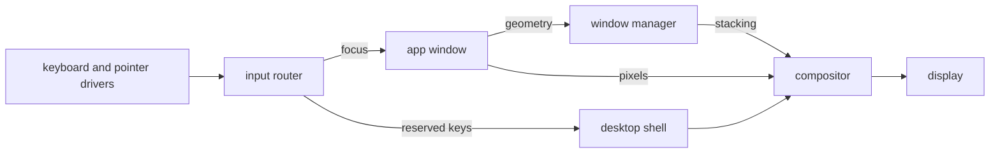

# The desktop

How to work the NONOS desktop: the menu bar, the dock, the Launchpad, windows, the apps that ship, and the few keys the desktop itself answers.

## What draws the screen

Three [capsules](../overview/glossary.md#capsule) make the desktop, and every pixel reaches the display through the compositor.

- The compositor draws every pixel a window shows. It presents through the virtio-gpu driver when one answers, otherwise through the kernel's copy to the UEFI framebuffer (`userland/compositor/README.md`).
- The window manager keeps each window's place, size, stacking order and focus. It never sees pixels (`userland/capsule_wm/README.md`).
- The desktop shell owns two full-screen layers: the desk under every window, with the desktop icons, and the chrome over every window, with the menu bar, the dock, the Launchpad, menus and notices (`userland/capsule_desktop_shell/README.md`).

The keyboard and pointer drivers send their events to the input router. A window gets the keys while it has focus. A small set of reserved keys never reaches a window and always goes to the desktop shell: they are listed under [Keys the desktop answers](#keys-the-desktop-answers). The app tells the window manager its geometry, and the window manager keeps the stacking the compositor draws.

The screenshot does not show this commit. The places of the menu bar, the desktop icons and the dock are as described here, but it has no menu titles and no magnifier, its icons are the entries of `/` rather than of the home folder, its dock has other tiles, and it shows a battery percentage, which this commit cannot show, since its kernel gives no charge.
