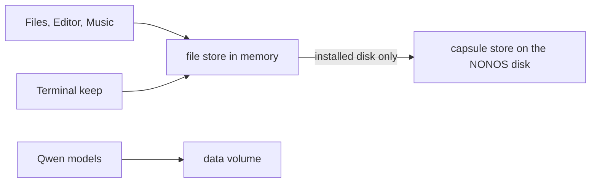

# Files

Where your files live on NONOS, how to work with them in Files, and exactly what is kept when the machine powers off.

## The short version

- Every file you see lives in the [file store](../overview/glossary.md#file-store), `vfs_pool`, which holds it in memory. At power off it is gone, unless it was written to the disk.
- NONOS forgets by default. The first mode setup offers is `Amnesic (default)`: RAM only, nothing written to any disk (`userland/capsule_setup_wizard/src/render/screens/mode.rs`). This is an [amnesic boot](../overview/glossary.md#amnesic-boot).
- Even on a system installed to a disk, Files and Editor do not write your files to the disk in this release. The Terminal's `keep` command is the one way to keep a file you made. See [What is kept after power off](#what-is-kept-after-power-off).

## What Files shows

Files (`app.file_manager`) browses the file store and nothing else (`userland/capsule_file_manager/README.md`). Its sidebar has:

- Home, Recents and Tags. Recents lists the files you opened, from the file store's access journal.
- Favourites, the entries you pinned with `f`.
- Places: Downloads (`/downloads/`), Root (`/`), Documents (`/docs/`) and Capsules (`/capsules/`) (`userland/capsule_file_manager/src/fm/paint_sidebar.rs`).
- At the foot, the drive card, labelled `NØNOS Drive`. Its bar counts file slots in use, not bytes, because the store states no byte ceiling to divide by.

What a fresh boot holds (`userland/capsule_vfs/src/store/fdtable/seed.rs`):

| Path | What is there |
|---|---|
| `/home/nonos` | Your home folder. The desktop icons are its entries. It starts with `readme.txt`, `documents` and `workspace`. |
| `/home/nonos/music` | The Music library. Music creates it when it is missing. |
| `/docs` | `about.txt` and `demo.txt`. |
| `/images` | Four sample pictures. |
| `/tmp` | Scratch space. |
| `/capsules` | Signed programs from the disk's store. Ordinary writes are refused there (`userland/capsule_vfs/src/server/handlers/path/is_read_only.rs`). |
| `/Movies` | Sample films, on an image built with them (`mk/40-run.mk`). |

A USB stick written by another system does not show up in Files. The file store reads one store, the one on the NONOS disk the machine booted from, and has no reader for other file systems (`userland/capsule_vfs/README.md`).

## Opening a file

`Enter`, or a click, opens a folder in place and a file in the app that reads it (`userland/capsule_file_manager/src/fm/open_with_table.rs`):

| Extension | Opens in |
|---|---|
| `txt`, `md`, `log`, `rs`, `toml`, `json`, `html` | Editor |
| `mp3`, `wav` | Music |
| `avi` | Video |
| `png`, `jpg`, `jpeg`, `bmp`, `gif` | Image Viewer |

Any other file opens in the preview pane, as text or, for a binary file, as hex.

## Working with files

Files works with the mouse and with single keys. Press `?` for the key list; any key closes it (`userland/capsule_file_manager/src/fm/help.rs`).

| Key | What it does |
|---|---|
| arrows, or `j`, `k`, `h`, `l` | Move, open, go up. |
| `Enter`, `l` | Open a folder, or preview a file. |
| `Backspace`, `h` | Up one folder. |
| `Space`, `a` | Check or uncheck an entry; select everything in view. |
| `n`, `m` | New file; new folder. |
| `r` | Rename. |
| `d` | Delete the selection or the entry under the cursor. Type `y` and `Enter` to confirm. |
| `c`, `x`, `p` | Copy, cut, paste into the current folder. |
| `o` | Duplicate. |
| `u` | Switch read-only on or off. |
| `f` | Pin or unpin in Favourites. |
| `t` | Tag or untag. |
| `s` | Sort by name, size, date or type in turn. |
| `/` | Filter; type to search. |
| `Esc` | Close the window. |

- Search finds files by name and by content. Content matching skips files over 1 MiB and binary files, which are still matched by name (`SEARCH_MAX_FILE_BYTES` in `userland/capsule_vfs/src/store/fdtable/search.rs`).
- The header's undo button reverses a new file, new folder, rename, permission change, paste, move or duplicate, and says whether all, part or none of it was put back.
- A delete cannot be undone. There is no trash, so a delete also empties the undo list.
- A folder whose listing failed shows `Files are not available` with the reason, never an empty folder.

## Limits of the file store

The file store refuses a write with "no room" (`ENOSPC`) past these limits, instead of failing as a whole (`userland/capsule_vfs/src/store/fdtable/budget.rs`):

- 2048 names in all, and one program may create at most a quarter of them.
- 64 MiB for one file.
- 160 MiB for all files together (`DATA_BYTES_MAX`).

## What is kept after power off



The file store is memory. A file reaches the disk only when the program that created it asks the store to keep it, and the store agrees only when the policy store's `Keep data across reboots` field is on (`require_persistent` in `userland/capsule_vfs/src/server/handlers/persist_gate.rs`). That field is set once, during setup: it is on when you choose `Install to this computer`. Settings shows it without letting you change it.

On an amnesic boot, the default, nothing is kept:

- Every request to keep a file is refused, and the store logs `[VFS] refused persist: amnesic boot`.
- On a live stick, the [data volume](../overview/glossary.md#data-volume) that holds Qwen models is held in memory, and nothing of this machine's is written to the stick (`src/fs/blockfs_volume/plan_types.rs`, `src/fs/blockfs_volume/open_machine.rs`).
- Setup asks its questions again at the next boot. If you install NONOS from this boot, the installer carries your answers to the new disk (`stage` in `userland/capsule_setup_wizard/src/keep/save.rs`).

On a machine where `Keep data across reboots` is on, as on a NONOS installed to a disk, these are kept:

- Setup's answers: your name, keyboard layout, time zone, wallpaper, the wallpapers kept, Qwen model, the apps turned off, the computer's name and the network route (`record_of` in `userland/capsule_setup_wizard/src/keep/save.rs`).
- Every value you change in [Settings](settings.md) that the policy store keeps (`KEPT` in `userland/policy_proto/src/settings_record.rs`).
- Saved Wi-Fi networks, sealed with the TPM machine key.
- The Terminal's theme, font size and side rail, Files' tags, favourites and view settings, and Snake's scores.
- The wallet's sealed files under `/data`. See [Wallet](wallet.md).
- Apps installed from the store.
- The data volume, on the disk, keyed by a key the TPM derives for this machine, or by a passphrase when it was made with one.
- Files you created in the Terminal and kept with `keep`.

These are not kept, even on an installed disk:

- Files you create or change in Files or in Editor. Neither app asks for a file to be kept.
- Music downloads in `/home/nonos/music`.
- Terminal history, scrollback, variables and aliases.

To keep a file, make it in the Terminal and keep it there:

```sh
write /home/nonos/notes.txt remember the backup
keep /home/nonos/notes.txt
```

Not tested in this release.

`keep` prints `persisted` when the file reached the disk. Three rules hold it (`userland/capsule_vfs/src/blk/store_write.rs`, `userland/nonos_disk_map/src/container.rs`):

- Only the process that created a file may keep it, so a file made in Files, or in another Terminal window, cannot be kept from this one (`persistable` in `userland/capsule_vfs/src/store/fdtable/persist.rs`).
- Once a path is kept, `keep` can replace its copy on disk only with contents of exactly the same length. Any other change is refused, and removing a kept file frees no disk space.
- The disk store holds at most 512 entries and 96 MiB of loaded files, the signed programs it already carries included. A kept path is at most 96 printable ASCII characters.

## See also

- [The desktop](desktop.md)
- [Terminal](terminal.md)
- [Settings](settings.md)
- [Sound and media](audio.md)
- [Install to disk](../install/install-to-disk.md)
- [Boot modes](../install/boot-modes.md)
- [Device secrets and keys](../security/device-secrets-and-keys.md)
