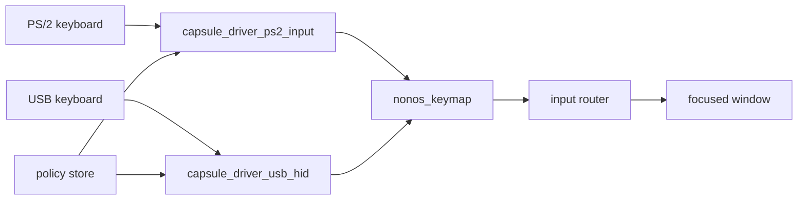

# Keyboard layouts

Which keyboard layouts NONOS has, how to choose one at first boot, how to switch while you type, and how PS/2 and USB keyboards apply them.

## The six layouts

NONOS resolves keys for six layouts. The table holds every one there is:

| Setup row | Name in setup | Short name | What differs from US |
|---|---|---|---|
| 1 | `US QWERTY` | `us` | The base layout. The extra key an ISO keyboard has beside left Shift gives nothing. |
| 2 | `UK` | `uk` | `"` and `@` swap, `£` on 3, `#` and `~` beside Enter. AltGr gives `€` on 4. |
| 3 | `German` | `de` | QWERTZ: Y and Z swap. Umlauts and `ß` on their German keys. AltGr gives `@` on Q, `€` on E, and the brackets and braces on 7 to 0. |
| 4 | `French AZERTY` | `fr` | A and Q swap, Z and W swap, M sits right of L, digits need Shift. AltGr gives `@` on 0, `€` on E, and the brackets on the number row. |
| 5 | `Italian` | `it` | Accented vowels right of P and L. AltGr gives `@` and `#` right of L, `€` on E, and the brackets right of P. |
| 6 | `Spanish` | `es` | `ñ` right of L, inverted punctuation beside the digits. AltGr gives `@` on 2, `#` on 3 and `€` on E. |

The right `Alt` key is AltGr on every layout but US. AltGr over a key with nothing on its third level gives the ordinary character.

The policy store's label list also names `US Dvorak`, `Russian`, `Japanese` and `Chinese`. No key table exists for them, so setup does not offer them, and a driver that is told one keeps the layout it has.

Known limits of the key tables:

- French and Spanish dead keys (circumflex, diaeresis, acute, grave) arrive as plain characters. Accents are not composed onto the next letter.
- On the German layout, Caps Lock does not capitalise an umlaut. Shift does.

## Choosing a layout at first boot

The first step of setup is `Keyboard layout`.

1. Move to a layout with `Up` and `Down`, or press its digit, `1` to `6`.
2. Press `Enter`.

The layout takes effect the moment you leave that step, not at the end of setup. The name and the Wi-Fi passphrase you type later in setup are typed in the layout you chose.

On an amnesic boot, setup asks again at every boot. On a system installed to a disk, the choice is kept with setup's other answers.

## Switching while you type

`Ctrl+Alt+Space` moves to the next layout, in the order `us`, `uk`, `de`, `fr`, `es`, `it`, then back to `us`. The keyboard driver takes the chord itself, so no app ever sees it as input.

- The switch lasts until the next one, or until the layout stored in the policy store changes.
- Each keyboard driver keeps its own switch. A layout chosen with the chord on a PS/2 keyboard does not change a USB keyboard plugged into the same machine, and the other way round.
- No notice appears on screen. The driver writes the new layout's short name only to its debug channel.

Settings has no keyboard layout row in this release, and setup is the only program that writes the layout to the policy store. On an installed system, each boot starts with the layout chosen at setup, and this release has no way to change that choice afterwards. Use the chord after each boot instead.

## How keyboards apply the layout

The layout is resolved in the keyboard driver and nowhere else. The PS/2 driver, `capsule_driver_ps2_input`, serves the keyboard behind the i8042 controller. The USB driver, `capsule_driver_usb_hid`, serves keyboards of the USB HID class, interface class 0x03. Both resolve every key through the same crate, `nonos_keymap`, so the two kinds of keyboard agree on every layout, Shift and AltGr state.

Each driver asks the [policy store](../overview/glossary.md#policy-store) for the `Keyboard layout` field on a key press, at most once a second. The input router and the focused window then receive the final character. No app applies a layout of its own, so the Terminal, Settings, the browser and Linux programs all type the same characters.

A key's release is sent with the same code as its press, even when Shift was let go in between, so a held key never sticks in an app that tracks held keys.

The PS/2 keyboard with its layouts: Works on an x86_64 laptop (Intel Gemini Lake, 8 GB), maintainer hardware report, 6 October 2026; the image commit was not recorded.

## Where this comes from

The code behind each section, at the commit in the footer.

- The six layouts
  - The six layouts: `Layout` in `userland/nonos_keymap/src/layout.rs:21-28`.
  - The six setup rows: `POLICY_LAYOUTS` in `userland/nonos_keymap/src/policy.rs:28`.
  - Right `Alt` as AltGr: `MOD_ALTGR` in `userland/capsule_driver_ps2_input/src/keymap/modifiers.rs:37-39`, and `ALTGR_MASK` in `userland/capsule_driver_usb_hid/src/hid/keymap/resolve.rs:22-24`.
  - The labels with no key table: `KEYBOARD_LAYOUT_LABELS` in `userland/policy_proto/src/keyboard_layout_labels.rs:17-28`.
  - Dead keys as plain characters: the notes above `letter` in `userland/nonos_keymap/src/tables/fr.rs:20-23` and above `symbol` in `userland/nonos_keymap/src/tables/es.rs:18-21`.
  - Caps Lock leaves an umlaut lowercase: the note above `letter` in `userland/nonos_keymap/src/tables/de.rs:19-23`.
- Choosing a layout at first boot
  - The step's keys: `on_key` in `userland/capsule_setup_wizard/src/render/screens/keyboard.rs:45-46`, and `list_nav` in `userland/capsule_setup_wizard/src/server/step.rs:32`.
  - The layout written as you leave the step: `write_on_advance` in `userland/capsule_setup_wizard/src/render/screens/keyboard_live.rs:13-22`.
- Switching while you type
  - The cycle order: `Layout::next` in `userland/nonos_keymap/src/layout.rs:55-57`.
  - Each driver's own switch, and the debug line: `LAYOUT_INDEX` and `cycle` in `userland/capsule_driver_usb_hid/src/hid/active.rs:28-52`.
  - No keyboard layout row in Settings: `ALL_FIELDS` in `userland/capsule_settings/src/settings/schema/all_fields.rs:24-41`.
- How keyboards apply the layout
  - USB interface class 0x03: `CLASS_HID` in `userland/capsule_driver_usb_hid/src/descriptors/types.rs:20`.
  - The policy store asked at most once a second: `POLICY` in `userland/capsule_driver_ps2_input/src/keymap/active.rs:31`.
  - A release sent with its press's code: `HeldKeys` in `userland/nonos_keymap/src/held.rs:32`.
  - Host tests that check the tables and the held-key rule, and pass on this commit: `userland/input_proofs` (`layout_tests.rs`, `held_keys_tests.rs`), 96 tests, and `userland/ps2_input_proofs`, 38 tests.

## See also

- [Settings](settings.md)
- [The desktop](desktop.md)
- [First boot](../install/first-boot.md)
- [PS/2 keyboard and mouse](../drivers/input/ps2.md)
- [USB HID](../drivers/usb/hid.md)
