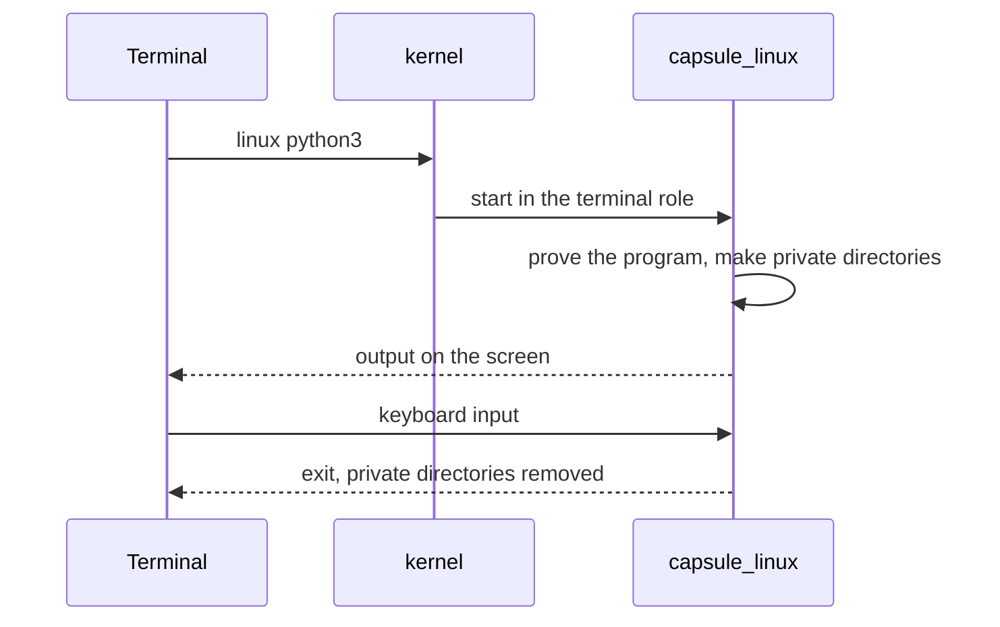

# Linux programs

Run Linux programs such as a shell, Python and SQLite from the NONOS Terminal, and know what they can reach and what they cannot.

## Run a program

Type `linux`, the program and its arguments in the Terminal:

```
linux sh
linux python3
linux python3 /usr/share/nonos/tour/mandelbrot.py
linux sqlite3
linux lua -e "print(_VERSION)"
linux john --test=0
```

Not tested in this release.

All but `linux sqlite3` come from the tour the image carries at `/usr/share/nonos/tour/README` in the Linux tree, which lists a few more, such as `linux zstd -b1`.

- A bare name is looked for along the guest's PATH; a name with a slash is a path in the Linux tree. `linux` alone prints `usage: linux <program> [arguments]`.
- The program's output appears in the Terminal and the keyboard is its input. `Ctrl+C` interrupts it.
- One Linux program runs at a time. A second one is refused with `linux: a Linux program is already running in a terminal; one runs at a time, so end it (Ctrl-C) first`.
- A name nothing holds is answered with `command not found`, and the line says where it looked.

The program runs under the [Linux personality](../overview/glossary.md#linux-personality), the [capsule](../overview/glossary.md#capsule) `capsule_linux`, which answers every Linux system call the program makes. The kernel itself knows nothing of Linux.



The Terminal asks the kernel to start `capsule_linux` in the terminal role. Before any page of a program from the store runs, the personality checks that it carries a proof that verifies. The store programs below are signed under the Linux userland publisher and enrolled like any capsule. The built-in BusyBox is part of the personality's own image, measured when the personality was admitted.

## What is installed

Standard images carry these programs: BusyBox inside the personality, the rest in the store under `/linux`. The store programs are built from sources pinned by SHA-256, or for mruby by the commit its 3.4.0 tag names. Each is built as a static, non-PIE x86-64 musl program.

| Command | Program | Version |
|---|---|---|
| `sh` and the other BusyBox programs | BusyBox | 1.36.1 |
| `python3`, also `python` and `python3.12` | CPython | 3.12.15, standard library in `/usr/lib/python312.zip` |
| `sqlite3` | SQLite shell, with readline | 3.53.4 |
| `lua` | Lua | 5.4.9 |
| `zstd` | Zstandard | 1.5.7 |
| `john` | John the Ripper | 1.9.0, word list in `/usr/share/john/password.lst` |
| `perl` | Perl | 5.44.0, with a trimmed library |
| `tclsh`, also `tclsh8.6` | Tcl | 8.6.18 |
| `mruby` | mruby | 3.4.0 |
| `qjs` | QuickJS | 2026-06-04 |
| `jq` | jq | 1.8.2 |
| `gojq` | gojq | 0.12.19 |
| `rg` | ripgrep | 15.2.0 |
| `fd` | fd | 10.5.0 |
| `nano` | GNU nano | 9.2 |
| `make` | GNU make | 4.4.1 |
| `openssl` | OpenSSL command line | 3.5.9 |

The other names (`python`, `python3.12`, `tclsh8.6`) are links in `/etc/nonos-links`. The `/bin/qwenchat` programs are there too; they run the local model, see [Local AI](local-ai.md).

BusyBox is built into the personality itself, so a machine with nothing in its store still runs a real Linux program. A name the Linux tree does not hold runs as a BusyBox program when BusyBox has one by that name. Its table in the shipped binary lists 305 names, `[` and `[[` among them: `ash`, `awk`, `sed`, `grep`, `vi`, `tar`, `less`, `xxd` and the rest. To see what is in the tree:

```
linux sh -c 'ls /usr/bin'
```

Not tested in this release.

John the Ripper's incremental-mode charset files are not shipped, so `john --incremental` has nothing to run with; word list and single modes have their files.

## Files: what a program sees, and how to share them

- The Linux tree is read-only to a program, and a write to it is answered with `read-only file system`.
- Each run gets its own `/tmp`, `/dev/shm`, `/home`, `/root`, `/run` and `/var/tmp`. They are made when the program starts and removed when it ends.
- Those directories hold at most 16 MiB and 128 names together. Past either, a write fails with ENOSPC.

So a file a program writes is gone when it exits. Move data between NONOS and a program with the Terminal's redirects:

- `< file` reads a NONOS file and gives it to the program as its whole input, then the end of input. The file must be smaller than 1 MiB.
- `> file` and `>> file` keep what the program writes to standard output and put it in the NONOS file when the program ends. Standard error stays on the screen. Output past 1 MiB is not kept, and the Terminal says so. `>` empties the file before the program starts, and a program stopped with `Ctrl+C` has none of its output written.
- A pipe into or out of a Linux program is refused. Run the pipe inside the program instead: the Terminal says `use: linux sh -c 'prog | grep x'`.

```
linux python3 < script.py > out.txt
linux sh -c 'ls /usr/bin | wc -l'
```

Not tested in this release.

See [Files](files.md) for the NONOS side.

## Network

A program started with `linux` has no internet. The kernel starts the personality for the Terminal in the role `app.linux.term`, which asks for no optional [capability](../overview/glossary.md#capability), so the network services refuse it. `wget`, or an HTTP request from `python3`, to an internet host fails.

Inside the program's own family, sockets work: it may bind and listen on 127.0.0.0/8 and use Unix sockets. A bind or listen anywhere else is EACCES, a datagram leaving the family is ENETUNREACH, and a raw socket is EPERM.

Once a program has opened a Qwen model, its family gets no internet socket in any role.

## What does not work

- A Linux system call the personality does not serve returns ENOSYS. Which calls are served and which are refused is on [the Linux personality page](../userland/linux-personality.md).
- A program is told the machine has one CPU, whatever it has. That is only what the Linux personality reports to its guests: the kernel itself schedules on every core, and a program's threads can run on several cores at once.
- No internet, as above.
- Nothing a program writes outlives it, except what a `>` redirect keeps.
- More packages come only from the Marketplace's Linux tab, and the standard build lists none; see [Marketplace](marketplace.md).

## When `linux` does not start

- Setup's app list has a `Linux and Qwen` switch. When it is off, the kernel refuses `tool.linux`, `tool.qwen` and `tool.model-fetch` with EACCES, and the Terminal prints `linux: the kernel refused to start it`. Safe Mode turns every optional app off for the boot, and Recovery keeps only Files and the text editor beside the Terminal and Settings.
- `linux: not installed in this build` means the image has no Linux personality.

## Hardware report

`sh`, `python3`, `sqlite3` and `john`: Works on an x86_64 laptop (Intel Gemini Lake, 8 GB), maintainer hardware report, 6 October 2026; the image commit was not recorded.

The host tests of the personality pass on this commit: `capsule_linux_proofs` (369 tests) and `terminal_line_proofs` (247).

## Where this comes from

The source behind the facts above, at the commit in the footer.

- Run a program
  - The tour's commands, `zstd` among them: `userland/linux_userland/tour/README:5-16`.
  - PATH lookup and the usage line: `requested` in `userland/capsule_linux/src/linux/terminal.rs:52-65`.
  - Store programs signed under the Linux userland publisher: `LINUX_USERLAND_CAPSULE` in `userland/linux_userland/Userland.mk:104-107`.
- What is installed
  - The store's Linux programs: `linux` in `tools/nix/store.json:100`.
  - Sources pinned by `sha256`: `tools/nix/sources.txt:1-5`; `mruby` by commit at `tools/nix/sources.txt:32`.
  - Static, non-PIE x86-64 musl: `LDFLAGS` in `tools/nonos-linux-userland-build:67-72`.
  - The other names of `python3` and `tclsh`: `userland/linux_userland/nonos-links:1-3`.
  - BusyBox built in: `BUILT_IN` in `userland/capsule_linux/src/linux/built_in.rs:24-27`. The 305 names are read from the shipped binary, `userland/capsule_linux/guests/busybox.elf`.
  - No incremental-mode charset files: `LINUX_USERLAND_STORE_DEPS` in `userland/linux_userland/Userland.mk:195-198`.
- Files: what a program sees, and how to share them
  - The tree is read-only: `writable` in `userland/capsule_linux/src/linux/file/root.rs:59-65`.
  - The private directories: `PRIVATE` in `userland/capsule_linux/src/linux/file/private/names.rs:28`.
  - 16 MiB and 128 names: `PRIVATE` and `PRIVATE_NAMES` in `userland/capsule_linux/src/linux/file/system/declared/sizes.rs:68-69`.
  - Input under 1 MiB: `read_input` in `userland/capsule_terminal/src/jobs/tool_redirect.rs:91-103`.
  - Output kept up to 1 MiB: `finish` in `userland/capsule_terminal/src/jobs/capture.rs:83-99`.
  - A pipe is refused: `admit` in `userland/capsule_terminal/src/command/dispatch/tool_admit.rs:32-43`.
- Network
  - The terminal role asks for no optional capability: `TERMINAL` in `src/userspace/capsule_linux/roles.rs:60-67`.
  - Loopback only: `not_loopback` in `userland/capsule_linux/src/linux/net/policy.rs:33-41`.
  - No internet once a model is open: `refuse_inet` in `userland/capsule_linux/src/linux/net/offline.rs:37-39`.
- What does not work
  - One CPU reported: `CPUS` in `userland/capsule_linux/src/linux/file/system/declared/sizes.rs:23`.
- When `linux` does not start
  - The `Linux and Qwen` switch: `tool_off` in `src/userspace/init/app_choice/names.rs:57-58`.
  - Safe Mode and Recovery: `BootProfile` in `src/userspace/init/app_choice/profile.rs:41-42`.

## See also

- [Terminal](terminal.md)
- [The Linux personality](../userland/linux-personality.md)
- [Local AI](local-ai.md)
- [Marketplace](marketplace.md)
- [Files](files.md)
