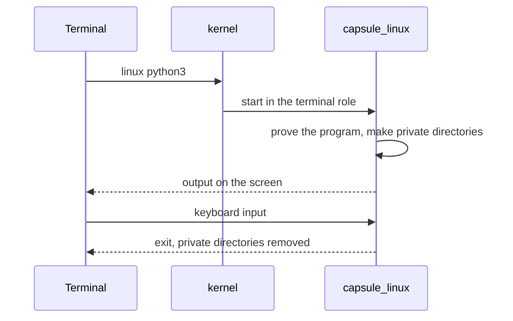

# Linux programs

Run Linux programs such as a shell, Python and SQLite from the NONOS Terminal, and know what they can reach and what they cannot.

## Run a program

Type `linux`, the program and its arguments in the Terminal:

```
linux sh
linux python3
linux python3 /usr/share/nonos/tour/mandelbrot.py
linux sqlite3
linux lua -e "print(_VERSION)"
linux john --test=0
```

Not tested in this release.

All but `linux sqlite3` come from the tour the image carries at `/usr/share/nonos/tour/README` in the Linux tree (`userland/linux_userland/tour/README`), which lists a few more, such as `linux zstd -b1`.

- A bare name is looked for along the guest's PATH; a name with a slash is a path in the Linux tree. `linux` alone prints `usage: linux <program> [arguments]` (`requested` in `userland/capsule_linux/src/linux/terminal.rs:52-65`).
- The program's output appears in the Terminal and the keyboard is its input. Ctrl-C interrupts it.
- One Linux program runs at a time. A second one is refused with `linux: a Linux program is already running in a terminal; one runs at a time, so end it (Ctrl-C) first`.
- A name nothing holds is answered with `command not found`, and the line says where it looked.

The program runs under the [Linux personality](../overview/glossary.md#linux-personality), the [capsule](../overview/glossary.md#capsule) `capsule_linux`, which answers every Linux system call the program makes. The kernel itself knows nothing of Linux.



The Terminal asks the kernel to start `capsule_linux` in the terminal role. Before any page of a program from the store runs, the personality checks that it carries a proof that verifies. The store programs below are signed under the Linux userland publisher and enrolled like any capsule (`userland/linux_userland/Userland.mk`). The built-in BusyBox is part of the personality's own image, measured when the personality was admitted.

## What is installed

Standard images carry these programs: BusyBox inside the personality, the rest in the store under `/linux` (`tools/nix/store.json`). The store programs are built from sources pinned in `tools/nix/sources.txt`, by SHA-256, or for mruby by the commit its 3.4.0 tag names. Each is built as a static, non-PIE x86-64 musl program (`tools/nonos-linux-userland-build`).

| Command | Program | Version |
|---|---|---|
| `sh` and the other BusyBox programs | BusyBox | 1.36.1 |
| `python3`, also `python` and `python3.12` | CPython | 3.12.15, standard library in `/usr/lib/python312.zip` |
| `sqlite3` | SQLite shell, with readline | 3.53.4 |
| `lua` | Lua | 5.4.9 |
| `zstd` | Zstandard | 1.5.7 |
| `john` | John the Ripper | 1.9.0, word list in `/usr/share/john/password.lst` |
| `perl` | Perl | 5.44.0, with a trimmed library |
| `tclsh`, also `tclsh8.6` | Tcl | 8.6.18 |
| `mruby` | mruby | 3.4.0 |
| `qjs` | QuickJS | 2026-06-04 |
| `jq` | jq | 1.8.2 |
| `gojq` | gojq | 0.12.19 |
| `rg` | ripgrep | 15.2.0 |
| `fd` | fd | 10.5.0 |
| `nano` | GNU nano | 9.2 |
| `make` | GNU make | 4.4.1 |
| `openssl` | OpenSSL command line | 3.5.9 |

The other names (`python`, `python3.12`, `tclsh8.6`) are links in `/etc/nonos-links` (`userland/linux_userland/nonos-links`). The `/bin/qwenchat` programs are there too; they run the local model, see [Local AI](local-ai.md).

BusyBox is built into the personality itself (`BUILT_IN` in `userland/capsule_linux/src/linux/built_in.rs:24-27`), so a machine with nothing in its store still runs a real Linux program. A name the Linux tree does not hold runs as a BusyBox program when BusyBox has one by that name. Its table in the shipped binary, `userland/capsule_linux/guests/busybox.elf`, lists 305 names, `[` and `[[` among them: `ash`, `awk`, `sed`, `grep`, `vi`, `tar`, `less`, `xxd` and the rest. To see what is in the tree:

```
linux sh -c 'ls /usr/bin'
```

Not tested in this release.

John the Ripper's incremental-mode charset files are not shipped (`userland/linux_userland/Userland.mk`), so `john --incremental` has nothing to run with; word list and single modes have their files.

## Files: what a program sees, and how to share them

- The Linux tree is read-only to a program (`writable` in `userland/capsule_linux/src/linux/file/root.rs:59-65` answers `read-only file system`).
- Each run gets its own `/tmp`, `/dev/shm`, `/home`, `/root`, `/run` and `/var/tmp` (`PRIVATE` in `userland/capsule_linux/src/linux/file/private/names.rs:28`). They are made when the program starts and removed when it ends.
- Those directories hold at most 16 MiB and 128 names together (`PRIVATE` and `PRIVATE_NAMES` in `userland/capsule_linux/src/linux/file/system/declared/sizes.rs:68-69`). Past either, a write fails with ENOSPC.

So a file a program writes is gone when it exits. Move data between NONOS and a program with the Terminal's redirects:

- `< file` reads a NONOS file and gives it to the program as its whole input, then the end of input. The file must be smaller than 1 MiB (`read_input` in `userland/capsule_terminal/src/jobs/tool_redirect.rs:91-103`).
- `> file` and `>> file` keep what the program writes to standard output and put it in the NONOS file when the program ends. Standard error stays on the screen. Output past 1 MiB is not kept, and the Terminal says so (`finish` in `userland/capsule_terminal/src/jobs/capture.rs:83-99`). `>` empties the file before the program starts, and a program stopped with Ctrl-C has none of its output written.
- A pipe into or out of a Linux program is refused. Run the pipe inside the program instead: the Terminal says `use: linux sh -c 'prog | grep x'` (`admit` in `userland/capsule_terminal/src/command/dispatch/tool_admit.rs:32-43`).

```
linux python3 < script.py > out.txt
linux sh -c 'ls /usr/bin | wc -l'
```

Not tested in this release.

See [Files](files.md) for the NONOS side.

## Network

A program started with `linux` has no internet. The kernel starts the personality for the Terminal in the role `app.linux.term`, which asks for no optional [capability](../overview/glossary.md#capability) (`TERMINAL` in `src/userspace/capsule_linux/roles.rs:60-67`), so the network services refuse it. `wget`, or an HTTP request from `python3`, to an internet host fails.

Inside the program's own family, sockets work: it may bind and listen on 127.0.0.0/8 and use Unix sockets. A bind or listen anywhere else is EACCES (`not_loopback` in `userland/capsule_linux/src/linux/net/policy.rs:33-41`), a datagram leaving the family is ENETUNREACH, and a raw socket is EPERM.

Once a program has opened a Qwen model, its family gets no internet socket in any role (`refuse_inet` in `userland/capsule_linux/src/linux/net/offline.rs:37-39`).

## What does not work

- A Linux system call the personality does not serve returns ENOSYS. Which calls are served and which are refused is on [the Linux personality page](../userland/linux-personality.md).
- A program is told the machine has one CPU, whatever it has (`CPUS` in `userland/capsule_linux/src/linux/file/system/declared/sizes.rs:23`).
- No internet, as above.
- Nothing a program writes outlives it, except what a `>` redirect keeps.
- More packages come only from the Marketplace's Linux tab, and the standard build lists none; see [Marketplace](marketplace.md).
