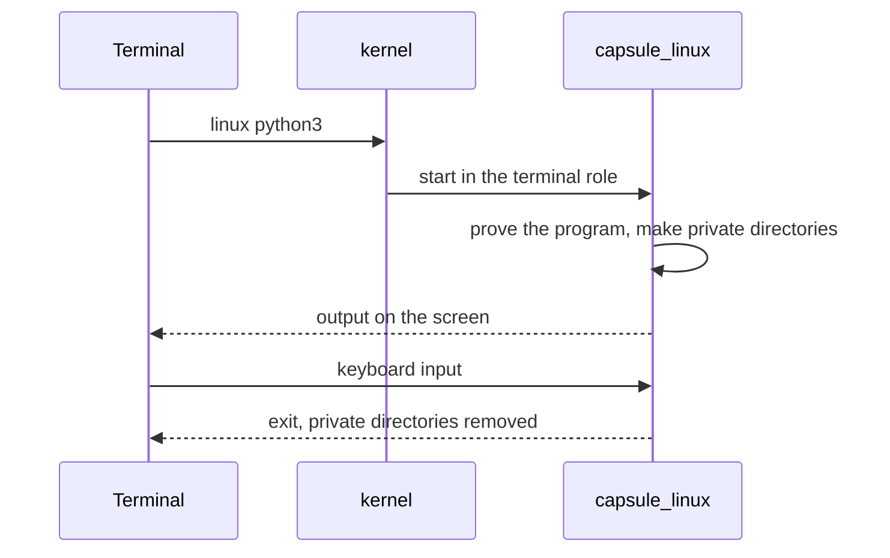

# Linux programs

Run Linux programs such as a shell, Python and SQLite from the NONOS Terminal, and know what they can reach and what they cannot.

## Run a program

Type `linux`, the program and its arguments in the Terminal:

```
linux sh
linux python3
linux python3 /usr/share/nonos/tour/mandelbrot.py
linux sqlite3
linux lua -e "print(_VERSION)"
linux john --test=0
```

Not tested in this release.

All but `linux sqlite3` come from the tour the image carries at `/usr/share/nonos/tour/README` in the Linux tree (`userland/linux_userland/tour/README`), which lists a few more, such as `linux zstd -b1`.

- A bare name is looked for along the guest's PATH; a name with a slash is a path in the Linux tree. `linux` alone prints `usage: linux <program> [arguments]` (`requested` in `userland/capsule_linux/src/linux/terminal.rs:52-65`).
- The program's output appears in the Terminal and the keyboard is its input. Ctrl-C interrupts it.
- One Linux program runs at a time. A second one is refused with `linux: a Linux program is already running in a terminal; one runs at a time, so end it (Ctrl-C) first`.
- A name nothing holds is answered with `command not found`, and the line says where it looked.

The program runs under the [Linux personality](../overview/glossary.md#linux-personality), the [capsule](../overview/glossary.md#capsule) `capsule_linux`, which answers every Linux system call the program makes. The kernel itself knows nothing of Linux.



The Terminal asks the kernel to start `capsule_linux` in the terminal role. Before any page of a program from the store runs, the personality checks that it carries a proof that verifies. The store programs below are signed under the Linux userland publisher and enrolled like any capsule (`userland/linux_userland/Userland.mk`). The built-in BusyBox is part of the personality's own image, measured when the personality was admitted.

## What is installed

Standard images carry these programs: BusyBox inside the personality, the rest in the store under `/linux` (`tools/nix/store.json`). The store programs are built from sources pinned in `tools/nix/sources.txt`, by SHA-256, or for mruby by the commit its 3.4.0 tag names. Each is built as a static, non-PIE x86-64 musl program (`tools/nonos-linux-userland-build`).

| Command | Program | Version |
|---|---|---|
| `sh` and the other BusyBox programs | BusyBox | 1.36.1 |
| `python3`, also `python` and `python3.12` | CPython | 3.12.15, standard library in `/usr/lib/python312.zip` |
| `sqlite3` | SQLite shell, with readline | 3.53.4 |
| `lua` | Lua | 5.4.9 |
| `zstd` | Zstandard | 1.5.7 |
| `john` | John the Ripper | 1.9.0, word list in `/usr/share/john/password.lst` |
| `perl` | Perl | 5.44.0, with a trimmed library |
| `tclsh`, also `tclsh8.6` | Tcl | 8.6.18 |
| `mruby` | mruby | 3.4.0 |
| `qjs` | QuickJS | 2026-06-04 |
| `jq` | jq | 1.8.2 |
| `gojq` | gojq | 0.12.19 |
| `rg` | ripgrep | 15.2.0 |
| `fd` | fd | 10.5.0 |
| `nano` | GNU nano | 9.2 |
| `make` | GNU make | 4.4.1 |
| `openssl` | OpenSSL command line | 3.5.9 |

The other names (`python`, `python3.12`, `tclsh8.6`) are links in `/etc/nonos-links` (`userland/linux_userland/nonos-links`). The `/bin/qwenchat` programs are there too; they run the local model, see [Local AI](local-ai.md).

BusyBox is built into the personality itself (`BUILT_IN` in `userland/capsule_linux/src/linux/built_in.rs:24-27`), so a machine with nothing in its store still runs a real Linux program. A name the Linux tree does not hold runs as a BusyBox program when BusyBox has one by that name. Its table in the shipped binary, `userland/capsule_linux/guests/busybox.elf`, lists 305 names, `[` and `[[` among them: `ash`, `awk`, `sed`, `grep`, `vi`, `tar`, `less`, `xxd` and the rest. To see what is in the tree:

```
linux sh -c 'ls /usr/bin'
```

Not tested in this release.

John the Ripper's incremental-mode charset files are not shipped (`userland/linux_userland/Userland.mk`), so `john --incremental` has nothing to run with; word list and single modes have their files.
