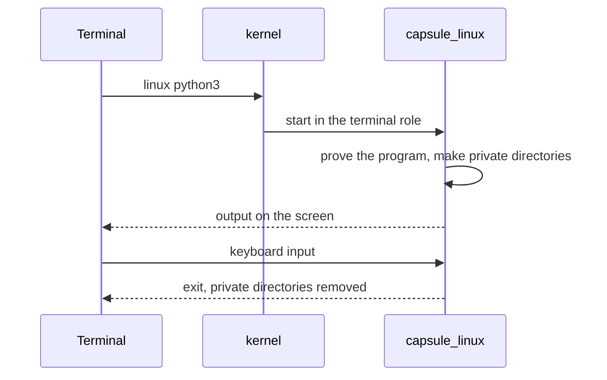

# Linux programs

Run Linux programs such as a shell, Python and SQLite from the NONOS Terminal, and know what they can reach and what they cannot.

## Run a program

Type `linux`, the program and its arguments in the Terminal:

```
linux sh
linux python3
linux python3 /usr/share/nonos/tour/mandelbrot.py
linux sqlite3
linux lua -e "print(_VERSION)"
linux john --test=0
```

Not tested in this release.

All but `linux sqlite3` come from the tour the image carries at `/usr/share/nonos/tour/README` in the Linux tree (`userland/linux_userland/tour/README`), which lists a few more, such as `linux zstd -b1`.

- A bare name is looked for along the guest's PATH; a name with a slash is a path in the Linux tree. `linux` alone prints `usage: linux <program> [arguments]` (`requested` in `userland/capsule_linux/src/linux/terminal.rs:52-65`).
- The program's output appears in the Terminal and the keyboard is its input. Ctrl-C interrupts it.
- One Linux program runs at a time. A second one is refused with `linux: a Linux program is already running in a terminal; one runs at a time, so end it (Ctrl-C) first`.
- A name nothing holds is answered with `command not found`, and the line says where it looked.

The program runs under the [Linux personality](../overview/glossary.md#linux-personality), the [capsule](../overview/glossary.md#capsule) `capsule_linux`, which answers every Linux system call the program makes. The kernel itself knows nothing of Linux.



The Terminal asks the kernel to start `capsule_linux` in the terminal role. Before any page of a program from the store runs, the personality checks that it carries a proof that verifies. The store programs below are signed under the Linux userland publisher and enrolled like any capsule (`userland/linux_userland/Userland.mk`). The built-in BusyBox is part of the personality's own image, measured when the personality was admitted.
