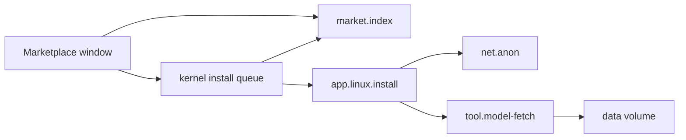

# Marketplace

What the Marketplace and the Terminal's `market` command can install on NONOS, how a listing is checked before anything is installed, and what needs a network.

## What you can install

| Tab | What it lists | In 0.9.2 |
|---|---|---|
| `Models` | The Qwen tiers | 17 tiers, from `userland/capsule_market/linux-guests.json`. Installing one puts its model files on the [data volume](../overview/glossary.md#data-volume); the chat program is part of the image. See [Local AI](local-ai.md). |
| `Linux` | Alpine packages a build lists | None. The shipped list, `userland/capsule_market/linux-packages.txt`, is empty, so the tab says `this build lists no Linux packages`. |
| `NONOS` | NONOS apps | None. NONOS apps ship in the image, so the catalogue lists none and the tab says `this catalogue lists no NONOS apps`. |
| `Community` | Apps from other publishers | None yet: `this catalogue lists no community apps yet`. |
| `All` | Everything above | |

The tabs are `TABS` in `userland/capsule_app_store/src/store/tab.rs:33`, and the empty-tab lines are `empty` in the same file, lines 52-61. Only listings whose id starts with `linux.` can be installed; selecting anything else says `part of this system: start it from the dock` (`ask` in `userland/capsule_app_store/src/store/install.rs:81-97`). A Qwen tier's id is `linux.qwen-` and the tier word, for example `linux.qwen-small` or `linux.qwen-qwen3-0.6b`.

The catalogue exists only in a build signed with the marketplace operator key. A build without that key embeds an empty catalogue, which the market reads as no catalogue at all (`mk/21-market.mk`), and every tab is empty.

Nothing costs money. A payment [capsule](../overview/glossary.md#capsule), `userland/capsule_payment`, is in the tree and has build rules, but no kernel profile embeds it, so no 0.9.2 image carries it.

## Use the Marketplace window

Open `Marketplace` from the dock (setup's app list calls it `App store`). The window asks the market for its catalogue, then for each listing's details one at a time, the selected one first.

| Key | What it does |
|---|---|
| Up, Down, Page Up, Page Down, Home, End | Move through the list. |
| Left and Right | Change tab. |
| `/` | Search, descriptions included. |
| Enter | The next sensible step: install, wait, or open. |
| `o` | Open an installed listing. |
| `u` | Uninstall. |
| `d` | Install a Qwen tier with its model downloaded directly. |
| `r` | Reload the catalogue. |

The keys are `on_key` in `userland/capsule_app_store/src/store/event_keys.rs:32-57` and `act` in `userland/capsule_app_store/src/store/event_actions.rs:29-66`. The selected listing's card shows its publisher, version, description and each install gate with its own verdict.

## Use the Terminal

```
market list
market info linux.qwen-small
market install linux.qwen-small
market uninstall linux.qwen-small
```

Not tested in this release.

`market` asks the same market service as the window, `market.index`, and takes these four forms (`USAGE` in `userland/capsule_terminal/src/command/builtin/market/run.rs:21-22`). `market install` refuses any id that does not start with `linux.`: `NONOS capsules come with the image`. When the market says a listing cannot install, it prints each gate that fails. After `install`, `market info <id>` shows how the install goes.

## How a listing is checked before it installs



The catalogue is signed. The market service, `market.index`, loads the catalogue built into the image, then a newer one at `/nonos/marketplace/index.bin` if there is one (`PATH` and `BASELINE` in `userland/capsule_market/src/boot_index.rs:27-36`). It accepts a catalogue only from an operator key in its trusted list, which holds one key in this release (`TRUSTED_OPERATORS` in `userland/capsule_market/src/bootstrap_trust/keys.rs:23`). The market holds no Network [capability](../overview/glossary.md#capability), so it never fetches a catalogue itself.

Each release must then pass six gates (`GATES` in `userland/market_proto/src/readiness.rs:21-28`, decided by `evaluate` in `userland/capsule_market/src/install_ready/checks.rs:28-63`):

| Gate | Passes when |
|---|---|
| `index signature` | The operator's signature over the catalogue verifies. |
| `package present` | The release names a package URL, a package hash and a manifest hash. |
| `publisher signature` | The release's publisher signature verifies. |
| `operator validation` | The operator marked the release validated. |
| `architecture` | The release runs on `x86_64-nonos` or `x86_64-linux`, and needs kernel ABI 1 at most. |
| `attestation` | The release carries a proof trailer hash, or it is a `linux.` listing for `x86_64-linux`, whose proof this machine makes after it has checked the bytes. |

Passing the gates in the window decides nothing on its own. The Marketplace window only queues a request with the kernel install queue. The kernel asks `market.index` for its verdict again, refuses the install when setup turned `Linux and Qwen` off, and hands the release's package hash to the installer, `app.linux.install` (`install` in `src/userspace/init/linux_jobs/service.rs:45-71`). Then:

- A Qwen tier: the chat program must be the one in the store, by the BLAKE3 the catalogue pins (`install` in `userland/capsule_linux/src/linux/install/apps_install.rs`), and each model file must have its pinned SHA-256. The model fetcher, `tool.model-fetch`, streams the files to the kernel, which links a file on the data volume only when its SHA-256 is the pin.
- A Linux package: the package chosen is held to the BLAKE3 the catalogue pins, and what it depends on to the distribution's own signed index (`fetch` in `userland/capsule_linux/src/linux/install/fetch.rs`).

A Linux package's proof is made on this machine after its bytes check out. Such a program runs only if setup's `Installed software` step was answered `Also software installed here` (`MODES` in `userland/capsule_setup_wizard/src/render/screens/local_software.rs:24`); the other answer is `Only NONOS software`. A Qwen tier installs only model files, and its chat program is part of the image.
