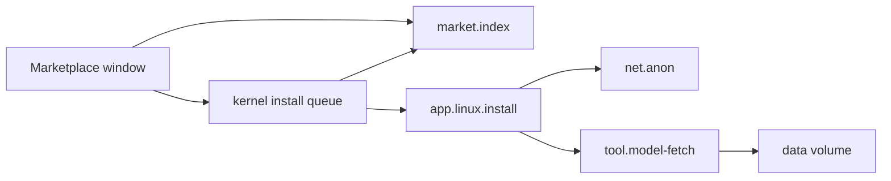

# Marketplace

What the Marketplace and the Terminal's `market` command can install on NONOS, how a listing is checked before anything is installed, what needs a network, and how to install a signed `.nonos` package file without the Marketplace.

## What you can install

| Tab | What it lists | In 0.9.2 |
|---|---|---|
| `Models` | The Qwen tiers | 17 tiers. Installing one puts its model files on the [data volume](../overview/glossary.md#data-volume); the chat program is part of the image. See [Local AI](local-ai.md). |
| `Linux` | Alpine packages a build lists | None. The shipped list is empty, so the tab says `this build lists no Linux packages`. |
| `NONOS` | NONOS apps | None. NONOS apps ship in the image, so the catalogue lists none and the tab says `this catalogue lists no NONOS apps`. A NONOS app from elsewhere comes as a package file; see [Install a package file](#install-a-package-file). |
| `Community` | Apps from other publishers | None yet: `this catalogue lists no community apps yet`. |
| `All` | Everything above | |

Only listings whose id starts with `linux.` can be installed; selecting anything else says `part of this system: start it from the dock`. A Qwen tier's id is `linux.qwen-` and the tier word, for example `linux.qwen-small` or `linux.qwen-qwen3-0.6b`.

The catalogue is signed with the marketplace operator key. The flake build behind `make` embeds the signed index and model catalogue committed under `nonos-data/market/` and `nonos-data/models/`, and both are in the tree at this release; the index lists the Qwen tiers. A seal without the operator key leaves those files as they are. Only a build with no such file embeds an empty catalogue, which the market reads as no catalogue at all, and then every tab is empty.

Nothing costs money. A payment [capsule](../overview/glossary.md#capsule) is in the tree and has build rules, but no kernel profile embeds it, so no 0.9.2 image carries it.

## Use the Marketplace window

Open `Marketplace` from the dock (setup's app list calls it `App store`). The window asks the market for its catalogue, then for each listing's details one at a time, the selected one first.

| Key | What it does |
|---|---|
| Up, Down, Page Up, Page Down, Home, End | Move through the list. |
| Left and Right | Change tab. |
| `/` | Search, descriptions included. |
| Enter | The next sensible step: install, wait, or open. |
| `o` | Open an installed listing. |
| `u` | Uninstall. |
| `d` | Install a Qwen tier with its model downloaded directly. |
| `r` | Reload the catalogue. |

The selected listing's card shows its publisher, version, description and each install gate with its own verdict.

## Use the Terminal

```
market list
market info linux.qwen-small
market install linux.qwen-small
market uninstall linux.qwen-small
```

Not tested in this release.

`market` asks the same market service as the window, `market.index`, and takes these four forms. `market install` refuses any id that does not start with `linux.`: `NONOS capsules come with the image`. When the market says a listing cannot install, it prints each gate that fails. After `install`, `market info <id>` shows how the install goes.

## How a listing is checked before it installs



The catalogue is signed. The market service, `market.index`, loads the catalogue built into the image, then a newer one at `/nonos/marketplace/index.bin` if there is one. It accepts a catalogue only from an operator key in its trusted list, which holds one key in this release. The market holds no Network [capability](../overview/glossary.md#capability), so it never fetches a catalogue itself.

Each release must then pass six gates:

| Gate | Passes when |
|---|---|
| `index signature` | The operator's signature over the catalogue verifies. |
| `package present` | The release names a package URL, a package hash and a manifest hash. |
| `publisher signature` | The release's publisher signature verifies. |
| `operator validation` | The operator marked the release validated. |
| `architecture` | The release runs on `x86_64-nonos` or `x86_64-linux`, and needs kernel ABI 1 at most. |
| `attestation` | The release carries a proof trailer hash, or it is a `linux.` listing for `x86_64-linux`, whose proof this machine makes after it has checked the bytes. |

Passing the gates in the window decides nothing on its own. The Marketplace window only queues a request with the kernel install queue. The kernel asks `market.index` for its verdict again, refuses the install when setup turned `Linux and Qwen` off, and hands the release's package hash to the installer, `app.linux.install`. Then:

- A Qwen tier: the chat program must be the one in the store, by the BLAKE3 the catalogue pins, and each model file must have its pinned SHA-256. The model fetcher, `tool.model-fetch`, streams the files to the kernel, which links a file on the data volume only when its SHA-256 is the pin.
- A Linux package: the package chosen is held to the BLAKE3 the catalogue pins, and what it depends on to the distribution's own signed index.

A Linux package's proof is made on this machine after its bytes check out. Such a program runs only if setup's `Installed software` step was answered `Also software installed here`; the other answer is `Only NONOS software`. A Qwen tier installs only model files, and its chat program is part of the image.

## What needs a network

- Browsing the catalogue does not. It is on the machine.
- Installing a Qwen tier does, unless it is `qwen3-0.6b` on a release stick that carries it. The download goes over the Anyone network, through its client `net.anon`, whatever the default network is, and waits up to three minutes for Anyone to build its first circuit. The card says the path before you install.
- Installing a Linux package does too, also over Anyone, and the exit resolves the mirror's name. A mirror named by a private address on your own network is dialled directly.
- `d` downloads a tier directly instead, for that install only. The card offers it when a download through an anonymity network would be large, and after one stopped because the network or its exits did not answer. A direct download is faster, and the mirror sees this machine's address.

See [Privacy networks](privacy-network.md).

## Where installs are kept

- A Linux package is held in memory until restart, on every boot: `Installed for this session, held in memory until restart. Enter opens it`.
- A Qwen tier's model is kept on the data volume: on the disk of an installed NONOS, or in memory on a live boot, gone at power off.

## When an install stops

The window and `market info` give the reason in words, and offer Retry only when asking again could help. Among them:

| Reason | Retry |
|---|---|
| `A live boot with no NONOS disk at all has nowhere to hold a model. Install NONOS: Install is in the dock` | No |
| `The data volume is locked; unlock it, then retry` | Yes |
| `No network to download the model over: the chosen one is not running` | Yes |
| `No signed model catalogue on this system lists it` | No |
| `The model did not match its pinned SHA-256, so none of it was kept` | Yes |
| `The model did not finish downloading; retry to go on from there` | Yes |
| `This machine has too little memory to run it; choose a smaller tier` | No |
| `This boot runs no network (Air-Gapped, Safe Mode or Recovery), and a model is downloaded or taken off the data volume only on a boot that does` | No |
| `Anyone did not build a circuit within 3 minutes; retry, or press d to download direct (the mirror sees this machine's address)` | Yes |
| `This system has no mirror for it` | No |
| `This system holds no key to check it with` | No |

The host tests of the market pass on this commit.

## Install a package file

A NONOS program from outside the catalogue comes as one signed file whose name ends in `.nonos`. Its publisher builds it with `tools/nonos-pack`; [Signing and publisher keys](../userland/signing-and-publisher-keys.md#publishers-outside-the-project) says how a publisher's program is signed and proved. The `installer` service checks the file with the kernel and writes its four parts into the [file store](../overview/glossary.md#file-store), and on a machine that keeps data into the [package store](../overview/glossary.md#package-store) on the disk too. The standard, hardened, qemu and dev images carry the installer. The air-gapped image does not: its profile drops the installer with the network programs.

### Put the file in /pkgs

The Launchpad offers each `.nonos` file in the folder `/pkgs` as a tile, named after the file without `.nonos`. The desktop looks in `/pkgs` again each time the file store changes. A fresh boot has no `/pkgs`, and Files cannot read a USB stick, so make the folder in the Terminal and fetch the file into it. `pull` fetches a file over plain HTTP, and runs only when Direct is the default network ([The network a command uses](terminal.md#the-network-a-command-uses)). A file already in the file store can be copied there with `cp`.

```sh
mkdir /pkgs
pull example.org/apps/hello.nonos /pkgs/hello.nonos
```

Not tested in this release.

### Install from the Launchpad

Open the Launchpad and click the package's tile. The desktop asks the installer to check the file, and shows `Install package?` with what the kernel verified:

- the name it installs under, which is the last part of its namespace, never the file name;
- the namespace, for example `com.example.gui_demo`;
- its tier, `NONOS-enrolled` for a namespace under `systems.nonos`, otherwise `Publisher-signed`;
- every [capability](../overview/glossary.md#capability) it would hold. When the list does not fit, the last line reads `! caps hidden - do not approve`.

`Approve` installs it, and the notices say `installing <name>`, then `installed <name>`. `Cancel`, `Esc` or a click outside the panel installs nothing. The file stays in `/pkgs` afterwards; delete it when you no longer need it.

### Install from the Terminal

```sh
pkg install /pkgs/hello.nonos
pkg install /pkgs/hello.nonos --yes
pkg status
pkg remove hello
```

Not tested in this release.

The usage is `pkg install <path> [--yes] | remove <name> | status`.

- `pkg install <path>` checks the file and prints its `name`, `namespace`, `tier` (`enrolled` or `publisher`), `caps` and the first 16 hex digits of its `digest`, then `run again with --yes to install`. It writes nothing. The path may be anywhere in the file store, not only in `/pkgs`.
- `pkg install <path> --yes` checks the file, installs it and prints `installed <name>`.
- `pkg remove <name>` deletes whichever of the installed parts exist, from memory and from the disk store, and prints `removed <name>`.
- `pkg status` says whether the disk store that keeps packages can be used: `store healthy`, `store loaded; a damaged entry was left out`, `no NONOS disk on this boot: packages are not kept`, or `store error` with a code.

`pkg install` and `pkg remove` run as jobs, so the window keeps drawing while the installer works. `Ctrl+C` stops the waiting, not the install: the installer finishes what it was asked, and its answer is dropped. A second request while one is out is refused with `pkg: the last request is still with the installer; try again shortly`.

### What is checked

The installer reads at most 16 MiB of the file and hands its four parts to the kernel, which runs the checks it runs before any program starts, and starts nothing:

- the manifest names a service and a reply endpoint;
- the [NONOS ID certificate](../overview/glossary.md#nonos-id-certificate) verifies under the [trust anchor](../overview/glossary.md#trust-anchor) built into the kernel;
- the [manifest](../overview/glossary.md#manifest) is bound to that certificate, stays within the namespaces and capabilities it allows, carries signatures that verify, and names this exact program;
- the [attestation trailer](../overview/glossary.md#attestation-trailer) verifies, under the root built into the kernel or under a root enrolled on this machine.

The installer then takes the BLAKE3 digest of the whole file. When you approve, or add `--yes`, it reads the file again, checks it again, and installs it only if the digest is the one you were shown, so a file swapped after the prompt is refused. A name that already has any of its four parts in the store, or that a running service answers to, is refused.

Which roots are enrolled decides which packages pass the trailer check. Setup's `Installed software` step enrolls this machine's own root when you answer `Also software installed here`; see step 11 of [First boot](../install/first-boot.md). A developer root enrolled by hand lasts until reboot.

### Where it lands, and whether it stays

The four parts go to `/capsules/<name>.elf`, `<name>.manifest.bin`, `<name>.nonos_id_cert.bin` and `<name>.zk_trailer.bin`. `/capsules` is read only to every other program.

- On a boot where `Keep data across reboots` is on, each part is also written to the disk store, so the package is still there after a restart. The disk store's limits apply, 512 entries and 96 MiB in all; see [Files](files.md#what-is-kept-after-power-off).
- On an [amnesic boot](../overview/glossary.md#amnesic-boot) it is held in memory and works until restart.

### Running it

An installed package gets its own Launchpad tile under its name. Each click on that tile asks `Launch third-party app?`, with the note `Its signature is checked as it loads; it gets only its manifest's permissions.` `Approve` has the installer load it, and the kernel runs its checks again before it starts; if it is already running, its window comes forward. The Terminal's `install <name>` starts it without the question.

### When a package is refused

The Launchpad shows `Package: ` and the reason, and `pkg` prints its own line:

| Launchpad | Terminal | When |
|---|---|---|
| `signature or digest failed verification` | `pkg: signature or digest failed verification` | The kernel refused the certificate, a signature or the trailer, or the file changed after you were shown it. |
| `malformed package or path` | `pkg: malformed package or path` | The file is missing, unreadable, over 16 MiB or not a package; its manifest names no endpoints; or the name or path is not valid. |
| `already installed` | `pkg: already installed, remove it first` | The name is taken in the store, or a running service answers to it. |
| `store write failed` | `pkg: store write failed` | The file store, or the disk store behind it, did not take a part. |
| `installer not ready, try again` | `pkg: installer not ready, try again` | The installer is not running or did not answer, as on an air-gapped image, which has none. |
| | `pkg: not installed` | `pkg remove` named nothing that is installed. |
| `installer not ready, try again` | `pkg: malformed reply from installer` | The installer's answer could not be read. |
| `the installer refused it` | `pkg failed: -` and a number | Any other answer. |

The desktop's list also has `not found`, for an answer that no install gives in this release: a missing file is reported as `malformed package or path`.

## Where this comes from

The code behind each section, at the commit in the footer.

- What you can install
  - The 17 tiers: `userland/capsule_market/linux-guests.json`, and the empty Linux list: `userland/capsule_market/linux-packages.txt`.
  - The tabs: `TABS` in `userland/capsule_app_store/src/store/tab.rs:33`, and the empty-tab lines: `empty` in `userland/capsule_app_store/src/store/tab.rs:52-61`.
  - Only listings under `linux.` install: `ask` in `userland/capsule_app_store/src/store/install.rs:81-97`.
  - The signed catalogue in the build: `signedInputs` in `tools/nix/capsules.nix`, and a seal that leaves it as it is: `seal` in `tools/nonos_seal/market.py`.
  - The payment capsule no profile embeds: `userland/capsule_payment`.
- Use the Marketplace window
  - The keys: `on_key` in `userland/capsule_app_store/src/store/event_keys.rs:32-57` and `act` in `userland/capsule_app_store/src/store/event_actions.rs:29-66`.
- Use the Terminal
  - The four `market` forms: `USAGE` in `userland/capsule_terminal/src/command/builtin/market/run.rs:21-22`.
- How a listing is checked before it installs
  - The built-in and newer catalogue: `PATH` and `BASELINE` in `userland/capsule_market/src/boot_index.rs:27-36`.
  - One trusted operator key: `TRUSTED_OPERATORS` in `userland/capsule_market/src/bootstrap_trust/keys.rs:23`.
  - The six gates: `GATES` in `userland/market_proto/src/readiness.rs:21-28`, decided by `evaluate` in `userland/capsule_market/src/install_ready/checks.rs:28-63`.
  - The kernel's second ask and the hand-off to `app.linux.install`: `install` in `src/userspace/init/linux_jobs/service.rs:45-71`.
  - The chat program held to its BLAKE3: `install` in `userland/capsule_linux/src/linux/install/apps_install.rs`.
  - A Linux package and what it depends on: `fetch` in `userland/capsule_linux/src/linux/install/fetch.rs`.
  - The two `Installed software` answers: `MODES` in `userland/capsule_setup_wizard/src/render/screens/local_software.rs:24`.
- What needs a network
  - Linux packages over Anyone: `for_installs` in `userland/capsule_linux/src/linux/install/http_route.rs:112`.
- Where installs are kept
  - The held-in-memory line: `installed_line` in `userland/market_proto/src/reason.rs:106-113`.
- When an install stops
  - The reasons, and when Retry is offered: `reason` in `userland/market_proto/src/reason.rs:127-242`.
  - Host tests that pass: `market_proofs` (62 tests).
- Install a package file
  - What the installer does: `userland/capsule_installer/README.md`.
  - The images that carry it: `nonos-capsule-installer` in the `microkernel-desktop-base` list in `Cargo.toml`, dropped from the air-gapped profile by `networkFeatures` in `tools/nix/config.nix:50-58`.
- Put the file in /pkgs
  - The tiles: `refresh` in `userland/capsule_desktop_shell/src/server/packages.rs:28-45`.
- Install from the Launchpad
  - The `Install package?` panel: `begin` in `userland/capsule_desktop_shell/src/server/handlers/pkg_install.rs:17-27`.
  - The hidden-caps line: `TRUNCATED` in `userland/capsule_desktop_shell/src/render/pkg_consent.rs:21`.
- Install from the Terminal
  - The `pkg` usage: `USAGE` in `userland/capsule_terminal/src/command/builtin/nox/pkg/work.rs:28`.
  - The store lines of `pkg status`: `status` in `userland/capsule_terminal/src/command/builtin/nox/pkg/manage.rs:28`.
  - Ctrl+C stops only the waiting: `stop_waiting` in `userland/capsule_terminal/src/command/builtin/nox/pkg/job.rs:132`.
- What is checked
  - The 16 MiB limit: `MAX_PACKAGE` in `userland/capsule_installer/src/server/handlers/pkg_query.rs:26`.
  - The kernel's checks: `run` in `src/syscall/microkernel/capsule_verify/verify.rs:44-79`, with the trailer under `verify_capsule_attestation` in `src/security/capsule_attest/verify.rs:33`.
  - The digest checked again on approval: `pkg_commit` in `userland/capsule_installer/src/server/handlers/pkg_commit.rs:39-51`.
- Where it lands, and whether it stays
  - The four parts' names: `EXTS` in `userland/capsule_installer/src/server/handlers/pkg_paths.rs:23`.
  - Written to the disk store when data is kept: `may_persist` in `userland/capsule_vfs/src/server/handlers/store_install.rs:62`.
- Running it
  - The launch question: `Target::Installed` in `userland/capsule_desktop_shell/src/server/handlers/launchpad.rs:97`.
- When a package is refused
  - The refusal lines: `package` in `userland/capsule_desktop_shell/src/state/says.rs:63-74` and `error` in `userland/capsule_terminal/src/command/builtin/nox/pkg/emit.rs:38-46`.

## See also

- [Local AI](local-ai.md)
- [Linux programs](linux-programs.md)
- [Privacy networks](privacy-network.md)
- [The desktop](desktop.md#the-launchpad)
- [Files](files.md)
- [First boot](../install/first-boot.md)
- [Manifests and capabilities](../userland/manifests-and-capabilities.md)
- [Signing and publisher keys](../userland/signing-and-publisher-keys.md)
