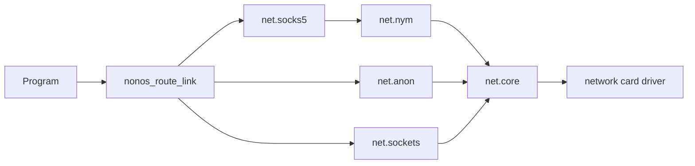

# Privacy networks: Nym, Anyone and Direct

Choose which network NONOS's own connections leave through, and know what each choice hides and what it does not.

## The three choices

| Choice | How a connection leaves | Who sees this machine's address | Cost |
|---|---|---|---|
| `Nym mixnet` (the default) | `net.socks5`, then `net.nym`: packets mixed and delayed through a gateway and three mix layers to an exit | The Nym entry gateway, and your local network, which sees that you use Nym | Slow: every packet is delayed on purpose. |
| `Anyone network` | `net.anon`: an onion circuit through three relays, guard, middle and exit | The guard relay, and your local network, which sees that you use Anyone | Much faster than the mixnet. |
| `Direct` | `net.sockets` straight to the host | Every site, every mirror and your local network | Fastest, and nothing hides you. |

The labels are the ones Settings shows (`ROUTE_LABELS` in `userland/policy_proto/src/route.rs:35`). The Nym mixnet is the default: setup's `Network route` step lists `Nym mixnet (default)` first (`ROUTES` in `userland/capsule_setup_wizard/src/render/screens/route.rs:12`), and a value the [policy store](../overview/glossary.md#policy-store) does not hold, does not know or cannot answer is read as Nym, never as Direct (`pick` in `userland/nonos_route_link/src/pick.rs:130-138`).

Setup's own words for each choice: the mixnet "Hides who you talk to, even from someone watching the whole internet"; Anyone means "Sites never see this machine's address" and "Someone watching both ends at once could match the traffic"; Direct means "Every site, the model mirror and your own network see this machine's address" (`WHY` in the same setup file).

## Switch networks

Open Settings, pick `Network`, and change the `Default network` row to `Nym mixnet`, `Anyone network` or `Direct`. The choice holds from the next connection: every program reads it again for each connection it opens (`chosen` in `userland/nonos_route_link/src/chosen.rs:40-43`). The browser can also switch network for one page.

A choice never falls back. If the chosen network is not running, the connection fails and says so, for example `the Nym mixnet, the default, is not running` (`NYM_DOWN` in `userland/nonos_route_link/src/pick.rs:43`). Nothing is retried over another network, and never over Direct.

The Terminal's `nym` command shows the mixnet client: `nym: gateway <address>` or `nym: client up, no gateway yet`, then a `topology:` line reading `ready`, `missing`, `expired`, `clock out of range` or `untrusted authority`. With no mixnet client on this boot it prints `nym: capsule not running`.

```
nym
```

Not tested in this release.

## How a connection finds its way



Every program that opens its own connections asks one library, `nonos_route_link`, which network to use. It sends a Nym stream to `net.socks5`, the SOCKS5 front of the mixnet, which resolves only `net.nym` and never a direct socket (`run` in `userland/capsule_socks5/src/setup.rs:27-38`). It sends an Anyone stream to `net.anon`, and a Direct one to `net.sockets`. All three reach the wire through `net.core` and the network card driver; see [Wi-Fi and networking](wifi-and-networking.md).

## Which programs follow the choice

| Program | What it does |
|---|---|
| Browser | Starts each page on the default. An `.anyone` address always goes through Anyone. |
| Terminal `curl`, `git clone`, `git push` | Follow the default. |
| Terminal `ping`, `nslookup`, `pull`, `push` | Run only when Direct is the default. Otherwise they print why and send nothing. |
| Wallet | Never Direct. Under a Direct default it uses Nym, or Anyone when Nym is not running. |
| Wallet's NOX Shield | Only Nym or Anyone, as the default names them. Under a Direct default it does not connect. |
| Qwen model downloads | Over Anyone, whatever the default. You can choose Direct for one download. |
| Linux package installs | Over Anyone, whatever the default, except a mirror on a private address, which is dialled directly. |
| Linux programs run with `linux` | No connection off the machine. |

The details, from the code:

- The direct-only commands ask `direct_refused` (`userland/nonos_route_link/src/direct_only.rs:33-41`). Under Nym, `ping example.com` prints `ping: the chosen network is the Nym mixnet, which is anonymous; ICMP cannot cross it and would leave directly, so nothing was sent`.
- The wallet takes `for_wallet`, which turns a Direct default into Nym, or Anyone (`private_only` in `userland/nonos_route_link/src/pick.rs:93-100`). The RPC node then sees which address is asked about, never which machine asks. See [Wallet](wallet.md).
- The shield's streams take the default as it is and refuse Direct (`anonymous_route` in `userland/shield_core/src/net/tor/stream.rs`).
- Installs take `for_installs`, which is Anyone (`install_route` in `userland/nonos_route_link/src/pick.rs:58-63`): the code's reason is that Nym exits rotate and end a long stream part way. A download waits up to three minutes for Anyone to build its first circuit. `qwen get --direct` in the Terminal, or `d` in the Marketplace, downloads one Qwen tier directly instead, and the mirror then sees this machine's address. See [Local AI](local-ai.md).
- A Linux package mirror named by an address in 10.0.0.0/8, 172.16.0.0/12, 192.168.0.0/16 or 169.254.0.0/16 is on your own network and is dialled directly (`is_local` in `userland/capsule_linux/src/linux/net/route.rs`). The shipped catalogue lists no Linux packages, so this applies only to a build that names such a mirror.
- The Settings note under `Default network` says it is what "Qwen downloads take", and a comment in `userland/policy_proto/src/route.rs` says installs cross the mixnet. Both are older than the code above: downloads go over Anyone.
- A Linux program started from the Terminal runs in a role the kernel spawns without the Network [capability](../overview/glossary.md#capability). It can still use loopback and Unix sockets inside its own family. See [Linux programs](linux-programs.md).
