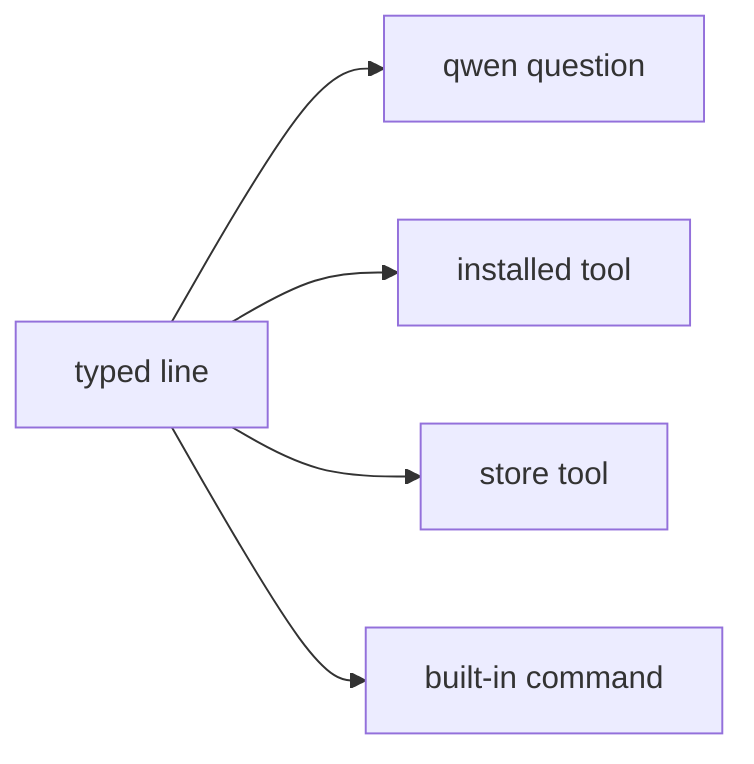

# Terminal

How to use the NONOS shell: tabs, line editing, pipes and redirects, background jobs, every built-in command, git over HTTPS, and what `Ctrl+C` does.

## What it is

Terminal (`app.terminal`) is one [capsule](../overview/glossary.md#capsule). The parser, the built-in commands and job control all run inside it; there is no separate shell process (`userland/capsule_terminal/README.md`). It also starts programs that are not built in, and runs them as foreground or background jobs with the keyboard as their input.

A typed name runs through one of four routes, and `type <name>` says which (`userland/capsule_terminal/src/command/builtin/which.rs`):



- A line that starts with `qwen` is a question for the local model. It is sent to the model as typed, and history keeps only `qwen` and the tier, never the question (`recorded` in `userland/capsule_terminal/src/command/builtin/qwen/ask.rs`). See [Local model](local-ai.md).
- An installed tool is a separate signed program, started as `tool.<name>`: `grex`, `dotenv-linter`, `pastel`, `jsonxf`, `tokei`, `huniq`, `csview`, and `linux` (`TOOLS` in `userland/capsule_terminal/src/command/builtin/tool.rs`).
- A store tool is one of `sd`, `tokio-smoke` and `std_proof`, loaded from the package store when the store holds it (`STORE_TOOLS` in `userland/capsule_terminal/src/jobs/classify.rs`).
- Everything else is a built-in command, listed below.

## Tabs and windows

- A window holds up to nine tabs (`MAX_TABS` in `userland/capsule_terminal/src/term/terminal/tabs.rs`). `Ctrl+Shift+T` opens one, `Ctrl+Shift+W` closes one, `Ctrl+PgUp` and `Ctrl+PgDn` switch, and `Ctrl+1` to `Ctrl+9` jump to a tab.
- Closing a tab, or the window, sends SIGTERM to every program that tab started (`userland/capsule_terminal/src/jobs/hang_up.rs`). Closing the last tab closes the window.
- `Ctrl+B` shows or hides the side rail. `Ctrl+K` opens a palette that filters, as you type, twelve common commands, the last twelve lines run in this tab, the open tabs, and a few actions such as a new tab or the next theme. `Enter` picks, `Esc` closes it (`build` in `userland/capsule_terminal/src/palette/index.rs`).
- `Ctrl+=` and `Ctrl+-` change the font size, from scale 1 to 6 (`MAX_FONT_SCALE` in `userland/capsule_terminal/src/term/dimensions.rs`).
- `theme` switches the colours: `dark`, `dim`, `light` or `abyss`.

## Editing a line

`help keys` prints a short form of this list (`userland/capsule_terminal/src/command/builtin/help_pages.rs`). It still names `Ctrl-K` for cutting to the end of the line; in this release `Ctrl+K` opens the palette and `Ctrl+Shift+K` cuts (`opens` in `userland/capsule_terminal/src/term/terminal/palette_key.rs`).

| Keys | What they do |
|---|---|
| `Ctrl+A`, `Ctrl+E` | Start or end of the line. With the cursor at the end, `Ctrl+E` takes the line history suggests. |
| `Ctrl+F`, `Alt+B`, `Alt+F`, `Ctrl+Left`, `Ctrl+Right` | One character forward, or one word back or forward. |
| `Ctrl+W`, `Alt+D`, `Ctrl+Shift+K`, `Ctrl+U` | Cut a word back, a word forward, to the end of the line, or the whole line. |
| `Ctrl+Y` | Put back what the last cut took. |
| `Ctrl+D`, `Ctrl+H` | Delete the character under the cursor, or the one before it. |
| `Tab` | Complete a command or a path. |
| `Up`, `Down`, `Ctrl+P`, `Ctrl+N` | Walk the history. |
| `Ctrl+R` | Search the history. Press it again for the next match. |
| `Ctrl+L` | Empty the scrollback. |
| `Ctrl+V`, `Ctrl+Shift+V`, `Shift+Insert` | Paste. |
| `Ctrl+Shift+C` | Copy the selection, or the line when nothing is selected. |
| `Ctrl+Shift+F` | Find in the scrollback. `Enter` goes to older matches, `Shift+Enter` to newer. |

With the mouse: drag to select, double-click a word, triple-click a line, `Alt`+drag a block. `Ctrl+D` never closes the terminal; `exit` does.

History expansion works as in other shells: `!!` is the last command, `!n` the nth, `!text` the last one starting with text. The expanded line is shown before it runs. A reference that matches nothing runs nothing and prints `no matching history entry`.

## Pipes, redirects and chains

`help shell` prints the syntax.

| Syntax | Meaning |
|---|---|
| `a \| b` | Feed the output of `a` to `b`. |
| `a > f`, `a >> f`, `a < f` | Write to, append to, or read from a file. `/dev/null` is nothing. |
| `a && b`, `a \|\| b`, `a ; b` | Run `b` on success, on failure, or always. |
| `a &` | Run `a` in the background. |
| `$name`, `$?` | A shell variable set with `set`, or the last exit status. |

After a `|`, only ten built-ins read the piped lines: `grep`, `sort`, `uniq`, `cut`, `nl`, `wc`, `head`, `tail`, `tac` and `rev`. Any other command after a `|` stops the pipeline and says so (`userland/capsule_terminal/README.md`). Redirects also work for Linux programs and the installed tools.

## Background jobs

`a &` starts a job and gives the prompt back. `jobs` lists the jobs, and `fg <id>` brings one to the foreground. Nothing is ever stopped, so `bg <id>` only says that a job runs on.

The built-ins that wait on the network or on an install run as jobs even in the foreground, so the window keeps drawing and `Ctrl+C` is read: `ping`, `install`, `curl` with its other names, `git clone`, and `pkg install` or `pkg remove` (`userland/capsule_terminal/src/jobs/classify.rs`).

## What Ctrl+C does

| While | `Ctrl+C` |
|---|---|
| typing a line | Drops the line and prints `^C`. |
| searching the history | Leaves the search and puts the line back as it was. |
| a Linux program runs in the foreground | Sends the byte 0x03 to the program's terminal, which turns it into SIGINT for the foreground group. The shell stays. |
| an installed tool runs in the foreground | Sends SIGINT (2) to it and ends the job. |
| a built-in job runs | Cancels the job. A `git clone` closes its connection and writes nothing. |

Code: `interrupt` in `userland/capsule_terminal/src/event/interrupt.rs`. `Ctrl+Shift+C` copies and never interrupts.

`Ctrl+D` on an empty input line ends the input of a Linux program. Any other program has no end of input yet, and the terminal prints `^D (end of input is not delivered to this program)`.

## Built-in commands

`help` lists the commands in groups, and `help <command>` shows one command's usage. These are the 69 commands it documents (`USAGE` in `userland/capsule_terminal/src/command/builtin/help_one.rs`), grouped here much as `help` groups them.

| Files | What it does |
|---|---|
| `ls` | List a directory. `-l` long, `-a` hidden, `-h` human sizes, `-R` recurse, `-t` by time, `-S` by size. |
| `tree` | Draw a directory and everything under it. |
| `cat` | Print files. `-n` numbers the lines. |
| `cd` | Change directory. With no argument, go to `$HOME`, `/home/nonos`. |
| `pwd` | Print the working directory. |
| `mkdir` | Make directories. `-p` makes parents too. |
| `touch` | Create empty files. A file that exists is left as it is. |
| `rm` | Remove. `-r` recurses into directories, `-f` ignores what is missing. |
| `rmdir` | Remove empty directories. |
| `mv` | Move or rename. |
| `cp` | Copy. `-r` recurses into directories. |
| `stat` | Kind, size, write bit and modification time of one path. |
| `find` | Walk a tree, filtering by `-name <pattern>`, `-type f` or `-type d`. |
| `du` | How many bytes the files under a path hold. |

| Text | What it does |
|---|---|
| `head`, `tail` | First or last lines, ten by default, `-n <count>` for another number. |
| `grep` | Search. `-i` ignores case, `-n` numbers, `-r` recurses, `-v` inverts, `-c` counts. No `-r` in a pipe. |
| `wc` | Count lines, words and bytes, with a total for several files. `-l`, `-w`, `-c`. |
| `echo` | Write the arguments back. |
| `sort` | Sort lines. `-n` numeric, `-r` reverse, `-u` unique. |
| `uniq` | Collapse repeated neighbouring lines. `-c` counts each run. |
| `cut` | The nth field of each line. `-d <char>` sets the separator, `-f <n>` the field; a space and field 1 by default. |
| `nl` | Number the lines. |
| `tac` | Reverse the order of the lines. |
| `rev` | Reverse the characters in each line. |

| System and identity | What it does |
|---|---|
| `capsules` | Every running capsule, with the capabilities the kernel granted it. |
| `service <name>` | The port and pid answering a service name. |
| `ps` | Every process in the kernel's table, with its parent and state. |
| `kill <pid or name> [signal]` | Signal a process, as in `kill browser`. Signal 9 by default. |
| `sys` | Version and build identity together. |
| `battery` | The charge, when the kernel gives one. In this release it prints `No battery` or `Battery status unavailable`, never a charge. |
| `about` | What this terminal is and how it reaches the rest of the system. |
| `version` | The release this terminal was built in, and who signed it. |
| `receipt [--hex]` | Every capsule as the kernel recorded it: measurement, signer, capabilities. |
| `log [word ...]` | The kernel's console lines, newest last. With words, only the lines naming one. |
| `bench` | Cycle costs of the kernel primitives, as percentiles. |
| `whoami`, `id` | Your name, then this capsule and who the kernel says signed it. |
| `date` | The real-time clock, as year-month-day hour:minute:second UTC. |
| `uptime` | How long the system has run, from the monotonic clock. |

| Network | What it does |
|---|---|
| `ping <host>` | Round trip to a host. Direct network only. |
| `ifconfig` | Interfaces, addresses and link state. |
| `nslookup <name>` | Resolve a name. Direct network only. |
| `curl <url>` | Fetch a URL over the chosen network. `http`, `get` and `fetch` are the same command. |
| `nym` | Mixnet client state: directory, gateway and route. |

| Apps | What it does |
|---|---|
| `market` | `market list`, `market info <id>`, `market install <id>`, `market uninstall <id>`. See [Marketplace](marketplace.md). |
| `install <name> [argv...]` | Verify, load and start the capsule held at `/capsules/<name>.*` in the store. |
| `pkg` | `pkg install <path> [--yes]`, `pkg remove <name>`, `pkg status`. |
| `git` | A git client over HTTPS. See [Git](#git). |
| `nox [command]` | The nox command index, or a command by its nox name. |
| `qwen [tier] [question]` | Chat with a Qwen model on this machine, offline. |
| `run <app>`, `open <app>` | Bring an app's window forward: `files`, `editor`, `settings`, `calc`, `about`, `procs`, `term`. |
| `exec <name> [argv...]` | Load a store capsule as this terminal's child and run it in the foreground. |

| Shell | What it does |
|---|---|
| `type <name...>`, `which <name...>` | Say which of the four routes a name runs through. |
| `history` | The commands run in this tab. |
| `jobs`, `fg <id>`, `bg <id>` | List, bring forward, or report background jobs. |
| `env` | The shell variables that are set. |
| `set [name value]`, `unset <name>` | List, set or remove a shell variable. |
| `alias [name expansion]`, `unalias <name>` | List, define or remove an alias, as in `alias ll ls -l`. |
| `theme [name]` | Switch the terminal's colours, or list them. |
| `clear` | Empty the scrollback. |
| `help [command]` | The grouped list, or one command in detail. |
| `exit` | Close this terminal. `quit` is the same. |

The shell also answers to names `help` does not list: `dir` (`ls`), `del` (`rm`), `caps` (`capsules`), `svc` (`service`), `host` (`nslookup`), `ip` (`ifconfig`), `bat` (`battery`), `profile` (`theme`), `commands` (`help`), and the nox names `where`, `in`, `read`, `copy`, `mk` and `move`. It also has `write <file> <text>`, `keep <path>` (see [Files](files.md)), `basename`, `dirname`, `apps`, `display`, `motd`, `neofetch`, and `pull` and `push`, which copy a file from or to a host over plain TCP (`userland/capsule_terminal/src/command/builtin/nox/dispatch.rs`).

## Linux programs

`linux` followed by a program name runs that program through the [Linux personality](../overview/glossary.md#linux-personality). The program reads the keyboard as a terminal. One that draws a full screen reads keys raw, as an xterm would send them.

```sh
linux sh
linux python3
```

Not tested in this release.

Which programs ship and which Linux calls are refused is on [Linux programs](linux-programs.md).

## Git

`git` is a client written for NONOS (`userland/nonos_git/README.md`). It works on a repository in the current directory of the file store.

```sh
cd /home/nonos/workspace
git clone https://example.org/team/project.git
cd project
write notes.txt remember the backup
git add notes.txt
git commit -m "first note"
git push
```

Not tested in this release.

- Subcommands: `init`, `clone <url> [branch]`, `add`, `status`, `commit -m <msg>`, `log`, `push [url]`, `remote` (`userland/capsule_terminal/src/command/builtin/git/dispatch.rs`).
- Only `https://` addresses. SSH and `git://` are not supported, nor are merge and rebase.
- `git clone` fetches only the tip, depth 1, of branch `main` unless you name another, into a folder named after the address's last part, with `.git` dropped. One response may be at most 64 MiB (`MAX_RESPONSE` in `userland/capsule_terminal/src/command/builtin/git/clone/job.rs`).
- Clone and push leave through the network chosen in Settings. When that network is not running, nothing is sent and the reason is printed.
- Git cannot send credentials in this release. When a server answers HTTP 401 or 403, git prints `the server wants credentials, which this cannot send yet` (`say_failure` in `userland/capsule_terminal/src/command/builtin/git/clone/fail.rs`). So `git push` works only to a server that takes a push without them.
- `git clone` runs as a job and `Ctrl+C` stops it. `git push` does not: the window waits until it ends.
- The repository lives in the file store, in memory. See [Files](files.md) for what survives a reboot.

## The network a command uses

`curl` and `git` connect through the network chosen in Settings: the Nym mixnet, the Anyone network, or Direct. `ping`, `nslookup`, `pull` and `push` reach a host directly and cannot cross an anonymity network, so they run only when Direct is chosen. Otherwise they print the reason and `so nothing was sent` (`userland/capsule_terminal/src/command/builtin/direct_gate.rs`). See [Privacy networks](privacy-network.md).
