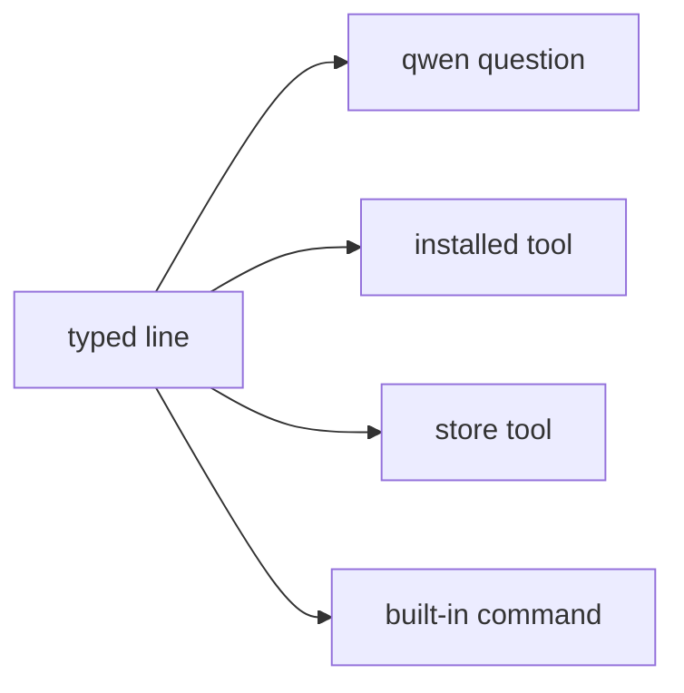

# Terminal

How to use the NONOS shell: tabs, line editing, pipes and redirects, background jobs, every built-in command, git over HTTPS, and what `Ctrl+C` does.

## What it is

Terminal (`app.terminal`) is one [capsule](../overview/glossary.md#capsule). The parser, the built-in commands and job control all run inside it; there is no separate shell process (`userland/capsule_terminal/README.md`). It also starts programs that are not built in, and runs them as foreground or background jobs with the keyboard as their input.

A typed name runs through one of four routes, and `type <name>` says which (`userland/capsule_terminal/src/command/builtin/which.rs`):

- A line that starts with `qwen` is a question for the local model. It is sent to the model as typed, and history keeps only `qwen` and the tier, never the question (`recorded` in `userland/capsule_terminal/src/command/builtin/qwen/ask.rs`). See [Local model](local-ai.md).
- An installed tool is a separate signed program, started as `tool.<name>`: `grex`, `dotenv-linter`, `pastel`, `jsonxf`, `tokei`, `huniq`, `csview`, and `linux` (`TOOLS` in `userland/capsule_terminal/src/command/builtin/tool.rs`).
- A store tool is one of `sd`, `tokio-smoke` and `std_proof`, loaded from the package store when the store holds it (`STORE_TOOLS` in `userland/capsule_terminal/src/jobs/classify.rs`).
- Everything else is a built-in command, listed below.
