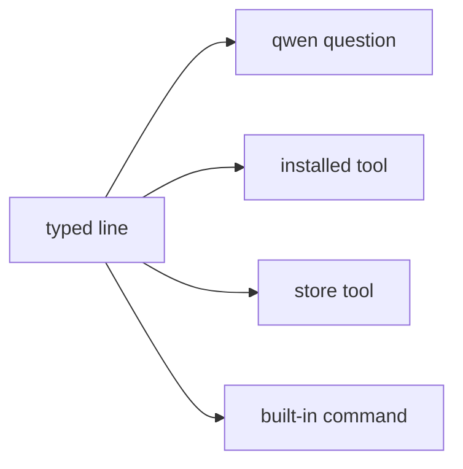

# Terminal

How to use the NONOS shell: tabs, line editing, pipes and redirects, background jobs, every built-in command, git over HTTPS, and what `Ctrl+C` does.

## What it is

Terminal (`app.terminal`) is one [capsule](../overview/glossary.md#capsule). The parser, the built-in commands and job control all run inside it; there is no separate shell process (`userland/capsule_terminal/README.md`). It also starts programs that are not built in, and runs them as foreground or background jobs with the keyboard as their input.

A typed name runs through one of four routes, and `type <name>` says which (`userland/capsule_terminal/src/command/builtin/which.rs`):

- A line that starts with `qwen` is a question for the local model. It is sent to the model as typed, and history keeps only `qwen` and the tier, never the question (`recorded` in `userland/capsule_terminal/src/command/builtin/qwen/ask.rs`). See [Local model](local-ai.md).
- An installed tool is a separate signed program, started as `tool.<name>`: `grex`, `dotenv-linter`, `pastel`, `jsonxf`, `tokei`, `huniq`, `csview`, and `linux` (`TOOLS` in `userland/capsule_terminal/src/command/builtin/tool.rs`).
- A store tool is one of `sd`, `tokio-smoke` and `std_proof`, loaded from the package store when the store holds it (`STORE_TOOLS` in `userland/capsule_terminal/src/jobs/classify.rs`).
- Everything else is a built-in command, listed below.

## Tabs and windows

- A window holds up to nine tabs (`MAX_TABS` in `userland/capsule_terminal/src/term/terminal/tabs.rs`). `Ctrl+Shift+T` opens one, `Ctrl+Shift+W` closes one, `Ctrl+PgUp` and `Ctrl+PgDn` switch, and `Ctrl+1` to `Ctrl+9` jump to a tab.
- Closing a tab, or the window, sends SIGTERM to every program that tab started (`userland/capsule_terminal/src/jobs/hang_up.rs`). Closing the last tab closes the window.
- `Ctrl+B` shows or hides the side rail. `Ctrl+K` opens a palette that filters, as you type, twelve common commands, the last twelve lines run in this tab, the open tabs, and a few actions such as a new tab or the next theme. `Enter` picks, `Esc` closes it (`build` in `userland/capsule_terminal/src/palette/index.rs`).
- `Ctrl+=` and `Ctrl+-` change the font size, from scale 1 to 6 (`MAX_FONT_SCALE` in `userland/capsule_terminal/src/term/dimensions.rs`).
- `theme` switches the colours: `dark`, `dim`, `light` or `abyss`.

## Editing a line

`help keys` prints a short form of this list (`userland/capsule_terminal/src/command/builtin/help_pages.rs`). It still names `Ctrl-K` for cutting to the end of the line; in this release `Ctrl+K` opens the palette and `Ctrl+Shift+K` cuts (`opens` in `userland/capsule_terminal/src/term/terminal/palette_key.rs`).

| Keys | What they do |
|---|---|
| `Ctrl+A`, `Ctrl+E` | Start or end of the line. With the cursor at the end, `Ctrl+E` takes the line history suggests. |
| `Ctrl+F`, `Alt+B`, `Alt+F`, `Ctrl+Left`, `Ctrl+Right` | One character forward, or one word back or forward. |
| `Ctrl+W`, `Alt+D`, `Ctrl+Shift+K`, `Ctrl+U` | Cut a word back, a word forward, to the end of the line, or the whole line. |
| `Ctrl+Y` | Put back what the last cut took. |
| `Ctrl+D`, `Ctrl+H` | Delete the character under the cursor, or the one before it. |
| `Tab` | Complete a command or a path. |
| `Up`, `Down`, `Ctrl+P`, `Ctrl+N` | Walk the history. |
| `Ctrl+R` | Search the history. Press it again for the next match. |
| `Ctrl+L` | Empty the scrollback. |
| `Ctrl+V`, `Ctrl+Shift+V`, `Shift+Insert` | Paste. |
| `Ctrl+Shift+C` | Copy the selection, or the line when nothing is selected. |
| `Ctrl+Shift+F` | Find in the scrollback. `Enter` goes to older matches, `Shift+Enter` to newer. |

With the mouse: drag to select, double-click a word, triple-click a line, `Alt`+drag a block. `Ctrl+D` never closes the terminal; `exit` does.

History expansion works as in other shells: `!!` is the last command, `!n` the nth, `!text` the last one starting with text. The expanded line is shown before it runs. A reference that matches nothing runs nothing and prints `no matching history entry`.

## Pipes, redirects and chains

`help shell` prints the syntax.

| Syntax | Meaning |
|---|---|
| `a \| b` | Feed the output of `a` to `b`. |
| `a > f`, `a >> f`, `a < f` | Write to, append to, or read from a file. `/dev/null` is nothing. |
| `a && b`, `a \|\| b`, `a ; b` | Run `b` on success, on failure, or always. |
| `a &` | Run `a` in the background. |
| `$name`, `$?` | A shell variable set with `set`, or the last exit status. |

After a `|`, only ten built-ins read the piped lines: `grep`, `sort`, `uniq`, `cut`, `nl`, `wc`, `head`, `tail`, `tac` and `rev`. Any other command after a `|` stops the pipeline and says so (`userland/capsule_terminal/README.md`). Redirects also work for Linux programs and the installed tools.

## Background jobs

`a &` starts a job and gives the prompt back. `jobs` lists the jobs, and `fg <id>` brings one to the foreground. Nothing is ever stopped, so `bg <id>` only says that a job runs on.

The built-ins that wait on the network or on an install run as jobs even in the foreground, so the window keeps drawing and `Ctrl+C` is read: `ping`, `install`, `curl` with its other names, `git clone`, and `pkg install` or `pkg remove` (`userland/capsule_terminal/src/jobs/classify.rs`).
