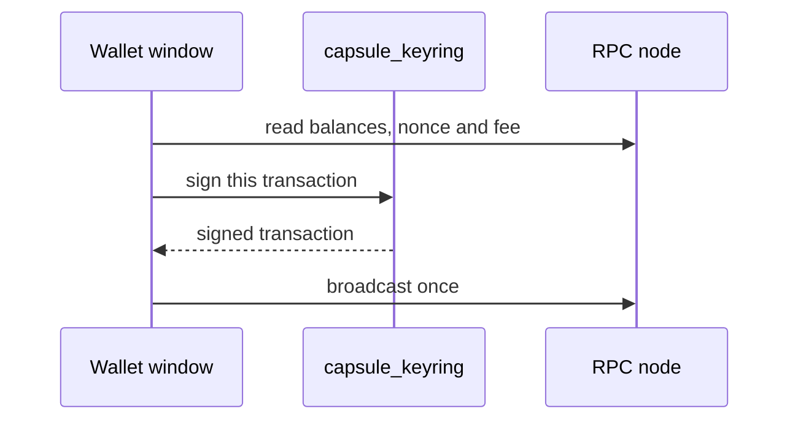

# Wallet

Keep an Ethereum account on NONOS: create it or restore it from recovery words, hold ETH, NOX and USDC, send, stake NOX and use the NOX Shield, with the private key kept by the keyring, not by the wallet window.

## Read this first: recovery words

- The recovery words are the account. Whoever has them can take everything it holds, on every network, and nothing can undo that.
- NONOS shows a new wallet's words once, on the `Recovery phrase` screen, straight after the wallet is made. The screen has no back button. `I wrote them down` is the only way on, and it wipes the words from the screen.
- Write them on paper, in order. Never type them into a website, and never take a picture of them.
- The copy NONOS keeps is sealed to this machine, its firmware and its kernel. After a firmware or kernel update, or on another machine, the sealed copy does not open. A live boot keeps nothing past power off, and a failed seal keeps nothing past reboot. In each case only the words bring the account back. If you lose the words then, the account is gone. NONOS cannot recover it.
- A wallet imported from a private key has no words. Keep the key itself written down, offline, before you import it.

## Create, restore or import

The first screen offers three buttons:

| Button | What happens |
|---|---|
| `Create a wallet` | The keyring draws 128 bits of entropy from the machine's mixed hardware sources and makes a 12-word BIP39 phrase. The phrase is shown once. |
| `Import a private key` | Type the key as 64 hex digits, `0x` optional. Each digit shows as a dot, and the key goes straight to the keyring. |
| `Restore from recovery words` | Type 12, 15, 18, 21 or 24 words in order, separated by spaces. They show as dots unless you choose `Show the words`. The BIP39 checksum is checked before anything is derived, so a mistyped phrase is refused and never opens a wrong account. |

The words derive the account at `m/44'/60'/0'/0/0`, the standard Ethereum path, with an empty BIP39 passphrase. Another wallet that uses this path and no passphrase derives the same account from the same words. A phrase that you used elsewhere with a BIP39 passphrase gives a different account here, because NONOS has no passphrase field.

`Add account` opens further accounts of the same phrase, `m/44'/60'/0'/0/1` to `m/44'/60'/0'/0/7`: eight accounts in all.

The wallet's own `Settings` screen picks the network (`Ethereum mainnet` or `Sepolia`), says whether the key is `sealed to this machine` or `RAM only, gone at reboot`, and offers `Show the private key`, `Restore from recovery words`, `Import a private key` and `Lock the screen`.

## Networks and assets

One address serves two networks. You switch between them in the wallet; every signature carries the chosen chain id, so a transaction reviewed on one network cannot be replayed on the other.

| | Ethereum mainnet | Sepolia |
|---|---|---|
| Chain id | 1 | 11155111 |
| ETH | yes | yes |
| NOX | `0x0a26c80be4e060e688d7c23addb92cbb5d2c9eca` | `0x3e5249a65ca513d5e11260222e0d26f46b465d36` |
| USDC | `0xa0b86991c6218b36c1d19d4a2e9eb0ce3606eb48` | `0x1c7d4b196cb0c7b01d743fbc6116a902379c7238` |
| NOX staking | `0xa94d6009790ba13597a1e1b7cf4e1531ea513613` | no |
| NOX Shield | no: the screen says `The shield pool is not deployed on Ethereum mainnet` and offers `Switch to Sepolia` | yes |
| RPC hosts, tried in order | `ethereum-rpc.publicnode.com`, `mainnet.gateway.tenderly.co`, `rpc.mevblocker.io` | `ethereum-sepolia-rpc.publicnode.com`, `sepolia.gateway.tenderly.co`, `rpc.sepolia.ethpandaops.io` |

The hosts and contracts are fixed in the code; the wallet has no field to add a network, a token or an RPC host.

Sepolia is Ethereum's test network, and the wallet says so: nothing on it has value. The NOX Shield is a private pool that runs only on Sepolia in this release. The `Receive` screen puts the difference this way: paid at the private address, "the sender, the amount, your balance and the notes you hold stay out of sight"; at the `0x` address, "anyone can see what this address holds and sends". The shield's keys and notes are kept by a separate capsule, `capsule_shield`. `Receive` shows the `0x` address, and on Sepolia the private address once the shield has opened for the account. `Copy address` puts the address shown on the clipboard every app shares, where any running program can read it until the clipboard clears, ten minutes after the last copy or paste. The wallet never copies a key or the recovery words. See [Copy and paste](desktop.md#copy-and-paste).

## Send

1. Press `Send`. It is enabled once the balance has been read.
2. Fill in the form and press `Review payment`. `Ctrl+V` pastes the recipient, and takes only one whole address, `0x` and 40 hex digits; anything else leaves the field as it was.
3. The review shows the amount, the network, `Network fee, at most`, `Gas limit` and the nonce, from a fresh nonce, fee and gas estimate. For ETH it adds `Total, at most`; for a token, the token contract.
4. `Confirm and send` signs and broadcasts once. `Edit` goes back.

The result reads `Sent. Waiting for the network to put it in a block.`, then `Confirmed: the payment is in a block, and twelve blocks hold it.` A transfer that reverts says `In a block, and the transfer reverted. Only the fee was spent.`

The wallet refuses to sign when the node gives no fee, a fee of zero, or a fee above 1000 gwei. A plain transfer to an account is signed at 21,000 gas; a contract call gets the node's estimate plus 20 percent.

## Where keys live and how signing works

- The private key lives in `capsule_keyring`, in memory. The wallet window asks the keyring for an address, a signature or a sealed copy over IPC. The keyring answers a request only for the process that stored the key, and the kernel stamps who sent each message.
- The window holds secret text only while it is on screen or being typed: the words on the `Recovery phrase` screen, a key or words you type to import or restore, and the key while `Show the private key` displays it. It wipes that copy when you hide the key.
- The keyring holds at most 128 keys, 16 for any one program. A wallet made from words takes two of them: its key and its words.
- Signing runs in the keyring: EIP-1559 transactions for transfers and staking, with secp256k1 in the keyring's own process.

The Wallet window reads balances, the nonce and the fee from the RPC node, asks `capsule_keyring` to sign, and broadcasts the signed transaction once.

## What NONOS keeps, and the TPM

On a boot that keeps data, the wallet writes these files under `/data` in the NONOS store:

| File | What it holds |
|---|---|
| `/data/wallet.vault` | The account key, sealed by the keyring. |
| `/data/wallet.words` | The recovery words, sealed by the keyring. |
| `/data/wallet.accounts` | Which accounts of the phrase are in use. Not secret. |
| `/data/wallet.kind` | Whether the wallet came from words or a private key. Not secret. |
| `/data/wallet.network` | Mainnet or Sepolia. Not secret. |

The seal is a key derived for each record from the [machine key](../overview/glossary.md#machine-key), which the TPM computes under an object bound to PCRs 0, 4, 7 and 9. Nothing stores that key. It is the same on every boot of this machine with this firmware and this kernel, and different anywhere else. That is why an update, or another machine, cannot open the sealed copy.

When the wallet cannot be kept, the status line says why and what to do, for example:

- `this is a live session: nothing is kept past power off, so this wallet is gone then; write down the phrase`
- `no machine key to seal under, so this wallet is gone at reboot: write down the phrase`, on a machine with no TPM
- `the disk is full, so this wallet is gone at reboot: write down the phrase`

## Network use

The wallet reads the chain over TLS, one batch of calls per refresh, and never over a direct connection. It takes the Nym mixnet or the Anyone network as the default network says; under a Direct default it uses Nym, or Anyone when Nym is not running. With neither running it reads nothing and says `the wallet reads the chain only over Nym or Anyone, and neither is running`.

The shield is stricter: it uses Nym or Anyone only when the default names one of them, and under a Direct default it does not connect.

The RPC node sees which addresses are asked about. Through Nym or Anyone it does not see this machine's address. See [Privacy networks](privacy-network.md).

## What the wallet does not do

- No swap: it is hidden in this build because no liquidity pool is wired.
- No other chains, no other tokens, no custom RPC host.
- No BIP39 passphrase.
- No passphrase on the keyring: `Lock the screen` hides balances, the address and every action, and `Open the wallet` brings them back without asking for one.
- No hardware wallet and no secure element.
- No shield on mainnet.
- No recovery of an account whose words and key are both lost.

Setup's app list has a `Wallet` switch. When it is turned off, the wallet does not start, and Safe Mode and Recovery boots do not start it either.

## Where this comes from

The code behind each section, at the commit in the footer.

- Create, restore or import
  - The three buttons: `welcome` in `userland/capsule_wallet_nonos/src/wallet/screen/welcome.rs:37-44`.
  - 128 bits of entropy, 12 words: `WORDS` in `userland/capsule_keyring/src/server/handlers/wallet_generate_hd.rs:32`.
  - The checksum checked before anything is derived: `wallet_recover` in `userland/capsule_keyring/src/server/handlers/wallet_recover.rs:32-66`.
  - The path `m/44'/60'/0'/0/0` and the empty passphrase: `account_key_at` in `userland/capsule_keyring/src/server/hd.rs:46-60`.
  - Eight accounts: `MAX_ACCOUNT_INDEX` in `userland/capsule_keyring/src/server/words_own.rs:24`.
  - The wallet's `Settings` rows: `ROWS` in `userland/capsule_wallet_nonos/src/wallet/screen/settings/mod.rs:42-47`.
- Networks and assets
  - Chain ids, contracts and RPC hosts: `MAINNET` and `SEPOLIA` in `userland/capsule_wallet_nonos/src/wallet/chain.rs:73-97`.
  - The `Receive` screen's words: `PUBLIC` and `PRIVATE` in `userland/capsule_wallet_nonos/src/wallet/screen/receive.rs:39-43`.
- Send
  - The 1000 gwei fee ceiling: `FEE_CEILING_WEI` in `userland/capsule_wallet_nonos/src/wallet/send/gas.rs:34`.
- Where keys live and how signing works
  - The shown key wiped when hidden: `toggle_export` in `userland/capsule_wallet_nonos/src/wallet/event/export_key.rs:28`.
  - 128 keys, 16 for one program: `MAX_KEYS` and `MAX_KEYS_PER_OWNER` in `userland/capsule_keyring/src/store/types/constants.rs:17-21`.
- What NONOS keeps, and the TPM
  - The five files under `/data`: `VAULT_PATH` and the paths beside it in `userland/capsule_wallet_nonos/src/wallet/vault/path.rs:23-42`.
  - PCRs 0, 4, 7 and 9: `BOUND_PCRS` in `src/security/tpm/machine_key/pcrs.rs:24`.
  - The status lines when nothing can be kept: `kept_status` in `userland/capsule_wallet_nonos/src/wallet/event/keep_plan.rs:76-93`.
- Network use
  - Nym or Anyone for the wallet, never direct: `for_wallet` in `userland/nonos_route_link/src/chosen.rs:46-48`.
  - No shield connection under a Direct default: `anonymous_route` in `userland/shield_core/src/net/tor/stream.rs:15-19`.
- What the wallet does not do
  - Swap hidden: `SWAP_OFFERED` in `userland/capsule_wallet_nonos/src/wallet/screen/home_actions.rs:38`.
  - The `Wallet` switch, and no wallet on Safe Mode or Recovery boots: `BootProfile` in `src/userspace/init/app_choice/profile.rs:41-42`.
  - Host tests that pass on this commit: `wallet_proofs` (184 tests), `nonos_secp256k1` (12), `shield_wire_proofs` (12) and `tpm_key_proofs` (42).

## See also

- [Privacy networks](privacy-network.md)
- [Device secrets and keys](../security/device-secrets-and-keys.md)
- [Measured boot and the TPM](../security/measured-boot-and-tpm.md)
- [Update](../install/update.md)
- [Settings](settings.md)
