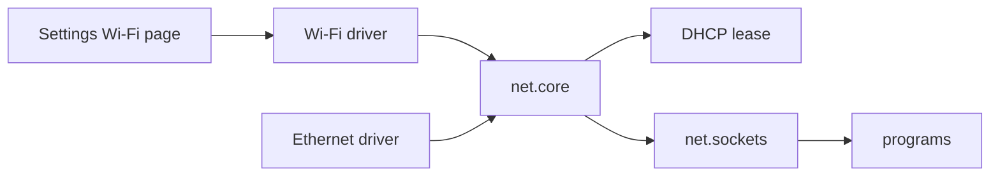

# Wi-Fi and networking

Put a NONOS machine on a network: join Wi-Fi in Settings, plug in a cable, and read what the status lines and join errors mean.

## Before you start

You need a network card NONOS has a driver for, an image that carries that driver, and a boot that runs the network.

- Wi-Fi: the Realtek RTL8821CE (PCI `10ec:c821`, `PCI_VENDOR_REALTEK` and `PCI_DEVICE_RTL8821CE` in `userland/capsule_driver_rtl8821ce/src/constants/mod.rs:25-26`) and Intel cards through the iwlwifi driver. These two are the only Wi-Fi drivers the panels know (`SERVICES` in `userland/nonos_wifi_client/src/driver/services.rs:32-35`). The Intel driver joins only on the parts whose firmware it boots; see [the Intel Wi-Fi page](../drivers/wifi/iwlwifi.md).
- Wired: `virtio_net` for QEMU, and the `e1000`, `rtl8139` and `rtl8169` driver capsules. Which cards each one takes, by PCI id, is on the [Ethernet](../drivers/ethernet/README.md) pages.
- The standard and hardened images carry all of these drivers: their kernel is built with the `microkernel-full-gui` feature list in `Cargo.toml` (`standard` and `hardened` in `tools/nix/config.nix:70-82`). The `qemu` image carries only `virtio_net`, so it has no Wi-Fi. An image built with the `airgapped` profile carries no network driver, stack or online program at all (`airgapped` in `tools/nix/config.nix:86-92`).
- The Air-Gapped, Safe Mode and Recovery boot modes start no network driver and no network service (`network` in `src/boot/handoff/api/profile.rs:44-46`). See [boot modes](../install/boot-modes.md).

Realtek RTL8821CE Wi-Fi, for scanning, joining, DHCP, DNS and browser traffic: Works on an x86_64 laptop (Intel Gemini Lake, 8 GB), maintainer hardware report, 6 October 2026; the image commit was not recorded.

Everything else on this page is stated from the code. The host tests of the Wi-Fi path pass on this commit: `rtl8821ce_proofs` (171 tests), `nonos_wifi_core_proofs` (70), `wifi_panel_proofs` (23), `iwlwifi_proofs` (205) and `net_core_proofs` (31).

## Join a Wi-Fi network

Open Settings and pick `Wi-Fi` in the sidebar. The page has four cards: `Wi-Fi` (the switch), `Connection`, `Networks` and `Saved networks` (`WIFI` in `userland/capsule_settings/src/settings/schema/blocks/wifi.rs:21-46`).

1. Check that the `Wi-Fi` switch is on. `W` flips it.
2. Press Enter to scan. The `Last join` row reads `Scanning...` until the driver answers. Networks are listed strongest first.
3. Move to a network with the arrow keys and press `C`, or click it.
4. A secured network opens a passphrase line. Type the passphrase, press Tab to show or hide what you typed, Enter to join, or Esc to cancel. Esc wipes what was typed.
5. The row reads `Joining <name>...`, then `Joined` or one of the errors listed below.
6. `D` leaves the network.

The page keeps its own keys (`wifi_key` in `userland/capsule_settings/src/settings/event/wifi_key.rs:42-63`):

| Key | What it does |
|---|---|
| `W` | Wi-Fi on or off. Off leaves the network and stops every scan and join. |
| Enter or Space | Scan. |
| `C` or a click | Join the highlighted network. |
| `D` | Leave the network. |
| `R` | Turn `Remember networks I join` on or off. |
| `F` | Forget the highlighted saved network. |
| Up and Down | Move through the scanned and saved networks. |
| Tab, `[` and `]` | Tab and `]` go to the next section, `[` to the previous one. |
| Esc | Close Settings, or cancel the passphrase. |

There is no Terminal command to scan or join Wi-Fi in this release. The Terminal's network commands are `ping`, `ifconfig`, `nslookup`, `curl` and `nym` (`GROUPS` in `userland/capsule_terminal/src/command/builtin/help_layout.rs:33-41`).

First-boot setup has its own Network step. It starts on `No network (default, private)` (`NO_NETWORK` in `userland/capsule_setup_wizard/src/render/screens/network.rs:10`), so setup joins no Wi-Fi network unless you pick one. A plugged-in cable is used without asking, and setup says so when it sees a wired card (`userland/capsule_setup_wizard/src/render/screens/network_lines.rs`).

## Which networks can be joined

The drivers share one join engine, `nonos_wifi_core`. It runs WPA2-Personal (PSK and PSK-SHA256) and WPA3-Personal (SAE), with CCMP-128 only (`select` in `userland/nonos_wifi_core/src/rsn/select.rs:87-104`). It refuses:

- open networks, with no RSN element (`OpenNetwork` in `userland/nonos_wifi_core/src/mlme/beacon.rs:50-52`);
- TKIP, 802.1X Enterprise, FT and OWE;
- access points that admit only 802.11n stations (`NeedsHt`, same file, lines 58-60).

A network that offers WPA3 and WPA2 side by side is joined with WPA3 first. If that does not finish, for any reason but a wrong password, the RTL8821CE driver joins it again with WPA2 (`retry_with_psk` in `userland/capsule_driver_rtl8821ce/src/serve/connect.rs:156-165`). A network saved after a WPA3 join is saved as WPA3 and is never joined with WPA2 again.

A passphrase is 8 to 63 characters, or 64 hex digits.

Two notes in the interface are older than this code. The `Connection` card in Settings reads `WPA2-Personal or open. WPA3 (SAE) cannot be joined.`, and setup says WPA3 and enterprise networks cannot be joined. The driver code above is what runs: WPA3-Personal joins, open networks do not.

A hidden network cannot be joined in this release. Settings joins only a network its scan heard, and there is no field to type a network name. The drivers can probe by name for a network saved as hidden, but nothing in this release saves a network that way.

## Remember networks

Turn on `Remember networks I join` with `R`. A network you then join is saved, with its passphrase, and joined again at the next boot when it is in range.

- At most four networks are kept; saving a fifth drops the oldest (`SLOTS` in `userland/nonos_wifi_client/src/saved/list.rs:18-19`).
- The list is saved only on a boot that keeps data: the `Keep data across reboots` choice made during setup, which Settings shows under `Privacy`. On any other boot the row reads `Off: this boot keeps nothing`.
- It is saved only with a TPM. The list is sealed with ChaCha20-Poly1305 under a [machine key](../overview/glossary.md#machine-key) the TPM derives for the label `wifi/saved-networks` (`LABEL` in `userland/nonos_wifi_client/src/saved/key.rs:18`). That key is bound to PCRs 0, 4, 7 and 9 (`BOUND_PCRS` in `src/security/tpm/machine_key/pcrs.rs:24`), so after a firmware or kernel change the saved list no longer opens and you join again by hand.
- The sealed record is the file `/nonos/wifi/saved` in the NONOS store (`PATH` in `userland/nonos_wifi_client/src/saved/file.rs:20-23`).

At boot, `net.core` scans and joins the first saved network in range. Each saved network is tried at most once per boot, so a wrong passphrase is not sent to the access point again and again. After eight scans with none in range (`EMPTY_PASSES_MAX` in `userland/capsule_net_core/src/autojoin/machine.rs:41`) it stops and logs `no saved Wi-Fi network in range; join one from Settings`.

## What the status shows

The `Status` row on the Wi-Fi page (`link` in `userland/capsule_settings/src/settings/ui/live_wifi.rs:21-53`, and `no_driver` in the same file, lines 115-130):

| Line | Meaning |
|---|---|
| `Connected to <name>` | The card is associated with that network. |
| `Not connected` | The driver is ready and no network is joined. |
| `<adapter>: <stage>` | The driver is still bringing the card up, or stopped at a step, for example `The card's firmware did not load`. |
| `Firmware stopped: <step> (0x....)` | The RTL8821CE firmware load stopped at the named step, with the control register's bits. |
| `No Wi-Fi hardware found` | No wireless chip is on the bus. |
| `Wi-Fi driver did not start for vvvv:dddd` | This build has a driver for the chip, and the driver is not running. |
| `Wi-Fi chip vvvv:dddd has no NONOS driver; use Ethernet or USB Wi-Fi` | No driver for this chip. NONOS has no USB Wi-Fi driver in this release, so a cable is the only other way. |

On an Intel card the driver takes but cannot use, the stage reads `card not supported yet; use Ethernet or USB Wi-Fi` (`DriverStage` in `userland/nonos_wifi_client/src/driver/stage.rs:19-63`). The same note about USB Wi-Fi applies. [Not supported](../drivers/wifi/not-supported.md) lists the cards with no driver.

Settings' `Network` page shows where the machine stands with DHCP. Its `Network status` card has `Connection` (`Connected`, `No address`, `Not responding` or `Offline`), `IP address`, `Gateway` and `DNS`. Its `Interfaces` card shows the `Wireless adapter`, or `None detected`.

In the Terminal, `ifconfig` (or `ip`) asks the DHCP client and prints one line:

```
ifconfig
```

Not tested in this release.

With a lease the line has the form `net0: inet <address>/<prefix> gw <gateway> dns <server>`; without one it is `net0: down` (`run` in `userland/capsule_terminal/src/command/builtin/nox/ifconfig.rs:30-71`).

## Join errors

The `Last join` row shows the driver's answer (`join_text` in `userland/nonos_wifi_client/src/driver/join_text.rs:15-36`):

| Line | Code | What it means |
|---|---:|---|
| `Joined` | 0 | Associated, keys installed. DHCP starts next. |
| `The radio is down or the request was malformed` | -1 | The driver could not run the join at all. |
| `The network was not heard on any channel` | -2 | The driver hunted for the network and heard no beacon from it. Scan again. |
| `The keys could not be installed in the card` | -3, -4 | The handshake finished and the card did not take the session keys. |
| `The access point refused the association` | -5 | The access point refused authentication or association, with its own status code. |
| `The handshake did not finish; check the passphrase` | -6 | A wrong WPA2 passphrase ends here: the access point drops the handshake without saying why. |
| `Saved as WPA3, but the network now offers only WPA2; not joined` | -7 | A possible downgrade. Forget the network with `F` only if you know why it changed. |
| `The network's security is not supported (open, TKIP or Enterprise)` | -8 | See the list of refused networks above. |
| `A passphrase is 8 to 63 characters, or 64 hex digits` | -9 | Fix the passphrase length. |
| `WPA3: the access point did not accept the password` | -10 | A wrong WPA3 password. |
| `The handshake did not match the network's beacon; not joined` | -11 | The access point's security changed during the handshake, a possible downgrade attempt. |
| `No randomness for the handshake; not joined` | -12 | The kernel gave the driver no random bytes. |
| `This driver cannot join networks yet` | -38 | The Intel driver cannot run a join on this card, or has no randomness for one. |
| `The driver did not answer` | | No reply came from the driver. |

The panel also says why it did not act:

- `Wi-Fi is off; W turns it on`
- `No Wi-Fi driver is running`
- `C joins a network from the scan list; Enter scans`
- `Still waiting for the driver's last answer; try again when it comes`

When a network cannot be remembered, the reason is one of: `This boot keeps nothing across reboots`, `No TPM to seal the passphrase with`, `Sealed under a different boot state`, `The TPM did not give the sealing key`, `Sealed elsewhere or altered on disk`, `The saved-networks record is damaged` or `No NONOS store on this boot's disk`.

## Ethernet

Plug in a cable. There is nothing to configure. About once a second (`REEVAL_INTERVAL_MS`, 1000 ms, in `userland/capsule_net_core/src/server/runner/run.rs:29`), `net.core` looks for a network card whose link is up, binds to it and starts DHCP. Its candidates are the Wi-Fi drivers first, then the wired ones (`WIFI_NICS` and `WIRED_NICS` in `userland/capsule_net_core/src/setup/candidates.rs:24-38`).

The `e1000e` and `igc` driver capsules are in the source tree, but no 0.9.2 image carries them: no kernel profile embeds them (`src/hardware/`, `Cargo.toml`). See [Intel Ethernet](../drivers/ethernet/intel.md).

## USB tethering and USB Ethernet

Not available in 0.9.2 images. `net.core` lists the `cdc_ecm`, `cdc_ncm`, `rndis`, `ax88179` and `rtl8153` drivers among its candidates (`WIRED_NICS`, same file), and the drivers are in `userland/`, but no kernel profile embeds them. A phone sharing its connection over USB, or a USB Ethernet adapter, is not used. See [USB networking](../drivers/ethernet/usb-net.md).

## DHCP and DNS



On the desktop one [capsule](../overview/glossary.md#capsule), `net.core`, is the whole network stack. When it starts it registers `net.tcp`, `net.udp`, `net.dhcp.client`, `net.dns` and `net.ip` (`all` in `userland/capsule_net_core/src/register.rs:41-46`). The Settings Wi-Fi page talks to the Wi-Fi driver to scan and join. `net.core` binds the Wi-Fi driver or the Ethernet driver once its link is up and takes a DHCP lease. Programs reach the network through `net.sockets`, which uses `net.core`.

- DHCP: on a lease, `handle_configured` sets the address, adds the default route through the router and opens a DNS socket for every server the lease names (`userland/capsule_net_core/src/iface/dhcp/handle_configured.rs:26-57`).
- DNS: a lookup asks every server at once and keeps the first IPv4 address any of them gives, within three seconds (`TIMEOUT_MS` in `userland/capsule_net_core/src/server/handlers/dns/lookups.rs:26`).
- IPv4 only. `net.core` builds `smoltcp` with IPv4 and no IPv6 (`userland/capsule_net_core/Cargo.toml:18-21`), and lookups ask for A records.

The tree also holds a split stack, one capsule per layer: `capsule_net_dhcp`, `capsule_net_dns`, `capsule_net_ip`, `capsule_net_tcp`, `capsule_net_udp` and `capsule_net_l2`. Desktop images do not carry them; `microkernel-desktop-base` carries `net.core` and `net.sockets` instead (`Cargo.toml:591-606`).

A name is looked up in the clear only for a connection that goes Direct. When the default network is Nym or Anyone, `ping` and `nslookup` refuse to run, and the programs that follow the default hand the name to the exit unresolved; see [Privacy networks](privacy-network.md).

With no address, `ping` and `nslookup` say so at once instead of timing out (`offline_line` in `userland/capsule_terminal/src/command/builtin/offline_gate.rs:43-57`). The line reads `ping: not connected to a network (no address yet). Plug in a cable or join a Wi-Fi network in Settings, then try again; nothing was sent`. On a boot that runs no network it reads `no network is running on this boot, so nothing was sent`.

## Limits in this release

- No open, TKIP, Enterprise or hidden networks.
- No USB Wi-Fi, no USB tethering, no USB Ethernet.
- No Wi-Fi in the `qemu` image.
- No IPv6.
- No Wi-Fi command in the Terminal.
- Saved networks need a TPM and a boot that keeps data.

## See also

- [Wi-Fi drivers](../drivers/wifi/README.md)
- [RTL8821CE](../drivers/wifi/rtl8821ce.md)
- [Ethernet drivers](../drivers/ethernet/README.md)
- [Privacy networks](privacy-network.md)
- [Settings](settings.md)
- [Terminal](terminal.md)
- [Hardware support matrix](../hardware/MATRIX.md)
