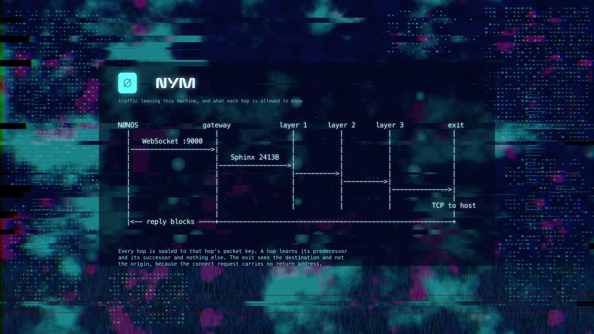

# capsule_net_nym

## Role

The Nym mixnet client. It registers with a gateway, seals application data
into Sphinx packets addressed through three mix layers, and hands them to
`net.tcp` over a WebSocket. Sphinx is reimplemented here in `no_std` against
the published format, because the reference stack cannot be linked into a
kernel userland.

This capsule is the network path, not an option on it. `capsule_socks5` sits
in front of it and resolves `net.nym` deliberately rather than `net.tcp`
(`../capsule_socks5/src/setup.rs:33`), so nothing that reaches the network
through `capsule_socks5` has a direct route to fall back to. Other capsules
that hold the Network capability can still reach `net.tcp` directly
.

```text
capsule_socks5 / other callers
 |
 | NYM1 requests over IPC (service:4470)
 v
+----------------------------- net.nym ------------------------------+
| session table | Sphinx sealing (3 mix layers) | SURBs and replies |
| topology gate | gateway client (WS + register) | cover on request |
| directory sync (nym-api over TLS) |
+--------------------------------------------------------------------+
 | MkIpcCall | MkIpcCallTimeout
 v v
 net.tcp net.dhcp.client (lease status)
 |
 +--> entry gateway (WebSocket) --> mix 1 --> mix 2 --> mix 3 --> exit gateway
 +--> validator.nymtech.net (TLS, directory)
```

## Microkernel contract

| | |
|---|---|
| handle | `net.nym` |
| endpoint | `service:4470:net.nym` |
| reply endpoint | `reply:4471:endpoint.net.nym.reply` |
| capabilities | `0x0003c` (Network, IPC, Memory, Crypto), Debug optional |
| transport | `net.tcp`, registered by `net.core` |
| kernel mirror | `src/userspace/capsule_net_nym` |

The syscalls it uses:

- `MkIpcRecvFrom` receives requests on inbox 0 with a 400 ms timeout
 (`src/server/runner.rs`). Before setup completes, `MkIpcRecv` waits on the same inbox
 (`src/main.rs`).
- `MkIpcReply` answers the kernel-attested sender pid (`src/server/respond.rs`).
- `MkIpcCall` reaches `net.tcp` (`src/tcp_client/envelope.rs:30`).
- `MkIpcCallTimeout` asks `net.dhcp.client` for lease status before a directory fetch
 (`src/directory_sync/lease.rs:58`).
- `MkServiceLookup` resolves `net.tcp`, `net.dhcp.client`, and `net.admin` for control-op
 authorization (`src/server/authz.rs`).
- The libc crypto calls `crypto_random`, `crypto_hash`, `crypto_hmac_sha256`,
 `crypto_hkdf_sha256`, `crypto_encrypt`, `crypto_decrypt`, `crypto_x25519_public` and
 `crypto_x25519_shared`.
- `MkDebug` writes the `[NET-NYM]` serial markers. `MkTimeMillis`, `MkUptimeMs`, `MkIdleMs`
 and `MkYield` pace the loops.

The kernel does not build Sphinx packets, hold mix keys, choose routes or talk to gateways.

## Interface contract

Operations are listed in `src/protocol/ops.rs:17`. The ones a caller normally
needs are open session, set destination, send, receive and close; the rest
configure topology, timing, credentials and the trust anchor.

| Operation | Value | Caller |
|---|---|---|
| `OP_HEALTHCHECK` | 1 | any |
| `OP_SET_GATEWAY` | 2 | admin |
| `OP_OPEN_SESSION` | 3 | any |
| `OP_SEND` | 4 | session owner |
| `OP_RECV` | 5 | session owner |
| `OP_COVER_TICK` | 6 | session owner |
| `OP_CLOSE` | 7 | session owner |
| `OP_SET_TOPOLOGY` | 8 | admin |
| `OP_SET_CREDENTIAL` | 9 | admin |
| `OP_CREATE_SURB` | 10 | session owner |
| `OP_SEND_REPLY` | 11 | session owner |
| `OP_SET_TIMING` | 12 | admin |
| `OP_SET_AUTHORITY` | 13 | admin |
| `OP_SYNC_DIRECTORY` | 14 | admin |
| `OP_TOPOLOGY_STATUS` | 15 | any |
| `OP_TIMING_STATUS` | 16 | any |
| `OP_SET_DESTINATION` | 17 | session owner; one destination binding at a time |
| `OP_SET_IDENTITY` | 18 | admin |
| `OP_GET_EXIT` | 19 | any |
| `OP_RECV_BATCH` | 20 | session owner |

"Admin" means the sender pid must equal the pid registered as `net.admin`
(`src/server/authz.rs`). No capsule registers that name today, so every admin op answers
`E_PERM` (deny by default). Sessions are kept per owner pid in the session table
(`src/state/table/`).

## Authority

`CAPSULE_REQUIRED_CAPS = 0x0003c` (`Capsule.mk`): Network, IPC, Memory and Crypto.
`CAPSULE_OPTIONAL_CAPS = 0x100` is Debug, which only a `capsule-serial-debug` build grants.
No FileSystem, Hardware, driver, MMIO, IRQ, DMA, PIO, Admin or graphics bit. The kernel
mirror's `spawn.rs` requests `IPC | Memory | Crypto | Network` and `serial_debug_cap()`.

### Trust

A session is refused over a topology that has not been admitted
(`src/state/table/topology_gate.rs:20`). A directory records where it came
from (`src/topology/directory.rs:25`), and `src/topology/admissible.rs` decides:

- `Signed`: fetched over the network, checked against an authority the operator installed.
- `Image`: compiled into the kernel, already measured, dual signed with Ed25519 and ML-DSA-65,
 and enrolled for the STARK spawn gate (its booted run is in progress).
- `Fetched`: node list fetched over TLS from nym-api, the certificate chain checked against
 `validator.nymtech.net`. It is admitted without an operator signature and is valid for one
 hour (`src/topology/fetched.rs`).

There is no route-signing key. Minting one would create a single seed whose
theft redirects every route the system takes, and the image already carries a
stronger guarantee than that key could add. Each mix hop is authenticated
again by its packet key when a header is sealed for it, so a stale entry
costs a dropped packet rather than a redirected one.

## Privacy and persistence

- Nothing is written to storage. The client Ed25519 identity is generated on first use and
 never persisted, so a gateway cannot link two boots of the same machine; bandwidth credit
 tied to an identity does not survive a reboot (`src/state/identity.rs`).
- The directory fetch is not anonymous: it goes to `validator.nymtech.net` at a pinned address
 (`src/directory_sync/pinned.rs`) over TLS, before any mixnet exists. No DNS query is made.
- Cover traffic is sent when a caller asks with `OP_COVER_TICK` and the timing policy says it
 is due (`src/server/handlers/cover.rs`); the capsule does not emit cover on its own timer.
- The serial log names the gateway address and each failed stage, not destinations or payload.

## Runtime lifecycle

1. `heap_init`, then wait for `net.tcp` to register, retrying every 250 ms (`src/main.rs`).
2. Install the topology that shipped in the image (`topology::install_builtin`).
3. Serve. When no request arrives within 400 ms, spend the gap in this order: directory fetch,
 gateway connect, keepalive, pump (`src/server/runner.rs`). The directory is fetched until it
 holds a gateway and an exit, and again in the ten minutes before a fetched list expires
 (`src/topology/refresh.rs`).
4. Every turn also reaps the sessions of ended clients and, every 5 s or on a change of stage,
 posts a route report to the attest service (`src/server/report/`). The report names no
 gateway, node or key; the board takes it only from `net.nym` holding Network.

### Reaching a gateway

The client walks a bootstrap list one candidate at a time from inside the
serve loop (`src/server/connect_tick.rs:53`), not all of them at startup.
Everything downstream waits on this capsule, so a blocking connect stalls the
desktop on a handshake nobody asked for. Failed attempts back off, since
retrying at tick rate leans on gateways other people run. The backoff doubles up to 64
idle turns and resets when a working gateway is lost (`src/server/connect_tick.rs:31`,
`src/server/connect_tick.rs:43`).

Every stage waits on elapsed time rather than a count of attempts. `net.tcp`
answers "nothing has arrived yet" with an empty read costing microseconds,
while a real round trip is tens of milliseconds, so counting a handful of
those and calling the peer finished gives up three orders of magnitude early.

Stages: TCP connect and wait for ESTABLISHED, WebSocket upgrade, registration
handshake, session. A keepalive ping goes out every 20 s (`src/server/keepalive.rs`).

## Failure model

The serial log names whichever gateway stage fails.

 [NET-NYM] gateway bound <ip> session established
 [NET-NYM] gateway <stage> <code> stage failed, with the reason

Request errors have one errno per cause (`src/protocol/errno.rs`): `E_BAD_MAGIC` 1,
`E_BAD_VERSION` 2, `E_BAD_OP` 3, `E_BAD_LEN` 4, `E_NO_TCP` 5, `E_NO_GATEWAY` 6,
`E_TABLE_FULL` 7, `E_NO_SESSION` 8, `E_CRYPTO` 9, `E_RX_EMPTY` 10, `E_NO_TOPOLOGY` 11,
`E_NO_CREDENTIAL` 12, `E_NO_ROUTE` 13, `E_CREDENTIAL_EXPIRED` 14, `E_GATEWAY_PROTO` 15,
`E_TOPOLOGY_AUTH` 16, `E_TOPOLOGY_STALE` 17, `E_AUTHORITY_MISSING` 18,
`E_AUTHORITY_UNTRUSTED` 19, `E_DIRECTORY_PROTO` 20, `E_DIRECTORY_SOURCE` 21,
`E_TOPOLOGY_EXPIRED` 22, `E_PERM` 23, `E_BUSY` 24.

An unknown op is answered with `E_BAD_OP`. A frame that fails header parsing is answered
under the op and request id `refused` reads from it, or under zeros when it is too short
(`src/server/parse_req.rs`). Requests that arrive before setup are still read into a one-byte
buffer and dropped without a reply (`src/main.rs`).

## Current implemented surface

- Sphinx packet construction across three mix layers and an exit gateway (`src/sphinx/`).
- LIONESS payload encryption (`src/sphinx/payload/`), SURB construction (`src/surb/`) and
 reply reassembly (`src/reply/`).
- Gateway client: WebSocket upgrade, registration handshake, keepalive (`src/gateway_client/`).
- Directory sync from nym-api over TLS, with lease gating (`src/directory_sync/`).
- Topology store, provenance gate and route draw (`src/topology/`).
- Session table of 32 entries, receive queue per session of 256 messages and 2 MiB, replay
 window of 64, SURB store of 64 (`src/state/`).
- Reply reassembly of up to 64 part-built messages and 2 MiB, a message at most 512 KiB, sets
 abandoned after 90 s without a piece (`src/reply/reassemble.rs`); reply block keys kept by
 digest until answered, up to 4096 (`src/surb/store.rs`); a per-session estimate of the
 blocks the exit holds, topped up ahead of need (`src/surb/budget.rs`).
- Control ops gated on `net.admin`.

## Wire format

### IPC

Requests and replies share a 20-byte little-endian header (`src/server/parse_req.rs`,
`src/server/respond.rs`): magic `0x4E594D31` at 0, version `1` at 4, op at 6, errno (reply)
at 8, reserved at 10, request id at 12, payload length at 16. Bodies are at most 32 KiB
(`src/protocol/limits.rs`); a longer reassembled reply is handed over across several reads.
`OP_RECV_BATCH` (body: session id, then optionally the most milliseconds to wait on an empty
link) answers with every queued message that fits, as records of a flag byte, a little endian
u32 length and the bytes (`src/protocol/batch.rs`); a message too long for one answer goes
as pieces flagged as beginning and continuing it, so a reader never takes a piece for a whole.

### Packet format

Sphinx, matching Nym's wire format so a live gateway reads our traffic.

| | bytes |
|---|---|
| header | 348 |
| payload | 2065 |
| total | 2413 |

The header is `32` ephemeral key, `16` integrity MAC and `300` encrypted
routing info, asserted at compile time in `src/sphinx/constants/sizes.rs`.
Routing information is layered so each hop strips one block and learns only
its predecessor and successor. Payloads use LIONESS wide block encryption,
ChaCha20 for the stream halves and Blake2b for the hash halves, matching
`NymLionessDigest`.

## State ownership

`net.nym` owns the session table, client identity, gateway state and shared key, SURB and
reply-key stores, replay window, credential, installed authority, timing policy and topology
(`src/state/`, `src/topology/`). `net.tcp` owns TCP connections. `net.dhcp.client` owns the
lease. The kernel owns none of it.

## Operating rules

- Never open a session over a topology the gate has not admitted.
- Reach the network only through `net.tcp`.
- Control ops only from the pid registered as `net.admin`.
- Dial gateways one candidate per idle moment, with backoff.
- Hold one client to `PER_OWNER` sessions, half the table, so no client can refuse every
 other program a session.
- Close the sessions of a client that ended without closing them, with their keys and unread
 replies: looked for every two seconds, and at once when a session cannot be opened
 (`src/server/reap.rs`, `src/state/table/ended.rs`).
- Do not persist identity, keys, routes or traffic.

## Release target

The finished capsule bootstraps a topology, binds a gateway, carries `capsule_socks5` streams
through three mix layers with SURB replies, answers every request including malformed and early
ones, and keeps all mixnet state in this process.

## Release evidence

Crypto is pinned by known answer tests that run against this capsule's own
modules, pulled in by `#[path]` so they cannot drift from the shipping code.

 cd tests/live_gateway && cargo test

POLYVAL carries RFC 8452 vectors specifically because a wrong implementation
is not visibly wrong: it produces a stable, self consistent tag that verifies
against itself and against nothing else.

`tests/live_gateway` also holds an interop runner that speaks to a real
gateway. It is not part of the unit run, since it needs the network.

Committed logs:

- `nym_topology_proofs`: 19 tests pass on main
. It runs the capsule's
 `topology/draw.rs`, `json/` and `directory_sync/` sources by `#[path]`.
- `capsule_socks5_proofs`: 65 tests pass on main
.
- No committed log of the `tests/live_gateway` unit run or interop runner, no booted run and
 no pcap; Nym and Anyone are listed as not run.

## Release checklist

- `tests/live_gateway` unit run committed in a log.
- A live gateway interop log ending in `run_handshake() COMPLETED`.
- A booted run logging `[NET-NYM] gateway bound` and a stream through `capsule_socks5`.
- A pcap of that run showing no clearnet traffic beyond the gateway and the directory fetch.
- Early requests answered rather than dropped (malformed ones are answered now).

## Explicit non-goals today

No direct clearnet route for callers, no route-signing key, no persisted identity or bandwidth
credit, no autonomous cover traffic schedule, and no `net.admin` principal (admin ops are denied).

## Verification

- Static gate: `bash nonos-ci/run-static-checks.sh`
- Build: `make -B nonos-mk-net-nym`
- Kernel profile: `cargo check --no-default-features --features microkernel-net-nym`
- Known answer tests: `cd userland/capsule_net_nym/tests/live_gateway && cargo test`
- Host proofs: `cd userland/nym_topology_proofs && cargo test --release`
- Host proofs: `cd userland/nym_reply_proofs && cargo test --release` (the reply path, and
 the session table's per-client share and the closing of ended clients' sessions)

## Further reading

- [The Nym mixnet capsule](../../docs/handbook/network/nym.md), the handbook page.
- [The SOCKS5 bridge and network routes](../../docs/handbook/network/socks5-and-routes.md),
 how callers reach this capsule and how the chosen network is read.
